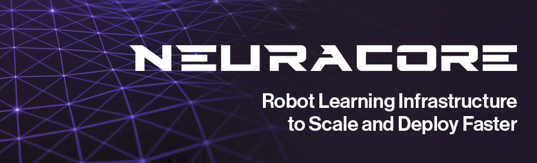

<div align="center">
  
</div>

<div align="center">

[](https://www.python.org/downloads/)
[](https://pypi.org/project/neuracore/)
[](https://discord.gg/DF5m8V6nbD)
[](https://opensource.org/licenses/MIT)

</div>

## What is Neuracore
**Neuracore** is a powerful robot learning library that enables **seamless data collection and visualization, model training, deployment, and real-time inference with comprehensive support for custom data types.** Get started with Neuracore today, [sign up for a Neuracore account](https://www.neuracore.com/)!
<div align="center" style="display: flex; justify-content: center; gap: 20px; flex-wrap: wrap; margin-bottom: 30px;">


</div>

## Features

- Streaming data logging with custom data types
- Dataset visualization and synchronization
- State-of-the-art robot learning algorithms
- Model management (locally and remotely on the cloud)
- Real-time policy inference and deployment
- Open source training infrastructure

## Getting Started

### Installation
To install the basic package for data logging and visualization:

```bash
pip install neuracore
```

**Note:** for faster video decoding, installing `ffmpeg` via `sudo apt-get install ffmpeg` (for Linux) is recommended. 

For training and ML development:
```bash
pip install neuracore[ml]
```

To run our examples:
```bash
pip install neuracore[examples]
```

**Note:** The `main` branch is considered a development branch. For production use, we recommend installing from PyPI (as shown above) or using the latest tagged commit.

### A Short Taste
Here is a short taste on what neuracore can do, for a detailed walk-through, please refer to the [tutorial](./docs/tutorial.md) and [documentation](#documentation).
```python
import neuracore as nc # pip install neuracore
import time

# ensure you have an account at neuracore.com
nc.login()

# Connect to a robot with URDF
nc.connect_robot(
    robot_name="MyRobot", 
    urdf_path="/path/to/robot.urdf",
)

# Create a dataset for recording
nc.create_dataset(
    name="My Robot Dataset",
    description="Example dataset with multiple data types"
)

# Recording and streaming data
nc.start_recording()
t = time.time()
nc.log_joint_positions(positions={'joint1': 0.5, 'joint2': -0.3}, timestamp=t)
nc.log_rgb(name="top_camera", rgb=image_array, timestamp=t)
# Stop recording, the dataset is automatically uploaded to the cloud
nc.stop_recording()

# Kick off training
dataset = nc.get_dataset("My Robot Dataset")
job_data = nc.start_training_run(
    name="MyTrainingJob",
    num_gpus=5,
    frequency=50,
    algorithm_name=diffusion_policy,
    ...
)

# Load a trained model locally
policy = nc.policy(
    train_run_name="MyTrainingJob",
    ...
)

# Get model inputs
nc.log_joint_positions(positions={'joint1': 0.5, 'joint2': -0.3})
nc.log_rgb(name="top_camera", rgb=image_array)
# Model Inference
predictions = policy.predict(timeout=5)
```
## Documentation
- [Examples](./examples/README.md)
- [Tutorials](./docs/tutorial.md)
- [Training](./docs/training.md)
- [Command Line Tools](./docs/commandline.md)
- [Environment Variables](./docs/enironment_variable.md)
- [Contribution Guide](./docs/contribution_guide.md)

## Community

We are building Neuracore to help everyone accelerate their robot learning workflows, and we'd love to hear from you! Join our community to get help, share ideas, and stay updated:

- [Discord](https://discord.gg/DF5m8V6nbD) - Chat with the community and get support
- [GitHub Issues](https://github.com/NeuracoreAI/neuracore/issues) - Report bugs and request features

## Citation

If you use Neuracore in your research, please consider citing:

```bibtex
@software{Neuracore,
  author = {Neuracore Team},
  title = {Neuracore},
  month = {January},
  year = {2026},
  url = {https://github.com/NeuracoreAI/neuracore}
}
