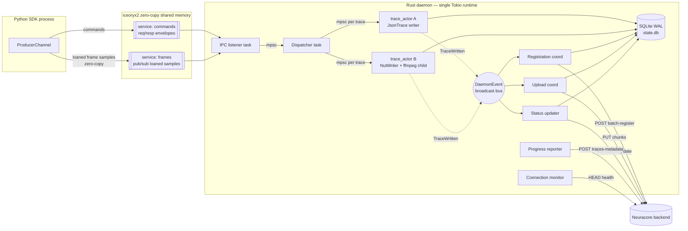
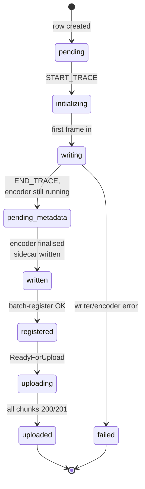
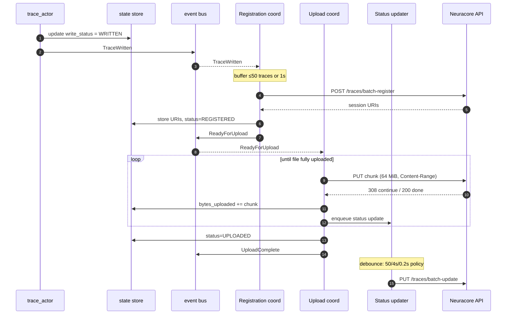

1# Rust Rewrite of the Data Daemon — Architecture & Implementation Plan

<!-- cSpell:disable  -->
## Context

The data daemon today is a Python service ([neuracore/data_daemon/](neuracore/data_daemon/)) that:

- Receives sensor frames + video from the SDK over a control socket (ZMQ) and shared-memory slots.
- Buffers, batches, and encodes them into per-trace `trace.json`, `lossy.mp4`, and `lossless.mp4` files on disk.
- Tracks lifecycle state in SQLite, then batch-registers traces and resumable-uploads files to the Neuracore backend.

The Python implementation has accumulated complexity: two-tier event loops, four spool shards plus four completion shards, a raw batch writer, and a separate batch encoder worker — all coordinating through a mix of asyncio queues, `threading.Queue`, semaphores, locks, and an event emitter ([data_daemon/communications_management/consumer/spool_worker.py](neuracore/data_daemon/communications_management/consumer/spool_worker.py), [data_daemon/event_loop_manager.py](neuracore/data_daemon/event_loop_manager.py)). The threading model is the main pain point.

The rewrite preserves all *external* contracts unchanged so the existing test suite passes byte-for-byte: HTTP API to the backend, CLI commands and flags, environment variables, output file layout and contents, PID-file and signal semantics. The *internal* design — IPC wire format, on-disk staging files, SQLite schema, threading model — is redesigned for simplicity and throughput.

### Hard contracts (unchanged)

| Contract | Source | Notes |
|---|---|---|
| Backend HTTP API | 7 endpoints, see "External API" below | Same paths, bodies, headers, retry policy, status codes |
| CLI commands | `launch`, `stop`, `status`, `profile {create,update,get,delete,list}`, `install`, `uninstall` | [main.py](neuracore/data_daemon/main.py), [args_handler.py](neuracore/data_daemon/config_manager/args_handler.py) |
| Env vars | `NCD_*` (8 profile overrides), `NEURACORE_DAEMON_*` (5 runtime), `NDD_DEBUG`, `NEURACORE_API_URL`, `NCD_MAX_SPOOLED_CHUNKS` | See "Environment variables" below |
| Output trace layout | `~/.neuracore/data_daemon/recordings/{recording_id}/{data_type}/{trace_id}/{trace.json,lossy.mp4,lossless.mp4}` | [const.py:63](neuracore/data_daemon/const.py#L63) |
| Process model | PID file (default `~/.neuracore/daemon.pid`), `/tmp/ndd/management.sock`, SIGTERM = graceful, SIGINT = graceful, SIGKILL recoverable on next launch | [const.py:43-44](neuracore/data_daemon/const.py#L43-L44) |
| Python entrypoint | `python -m neuracore.data_daemon <cmd>` must keep working — test infra invokes it directly | Replace `__main__.py` with a thin shim that `exec`s the Rust binary with the same argv |

### What changes (internal)

- SDK ↔ daemon IPC: replace ZMQ envelopes + `multiprocessing.shared_memory` with **iceoryx2** zero-copy shared-memory services. No Unix socket on disk. The producer side is no longer a pure-Python implementation that links the iceoryx2 Python bindings; instead, the producer-side IPC client is implemented in Rust and exposed to Python through a **PyO3** module (`neuracore.data_daemon._native_producer`). The native module exposes a small, stable surface — `start_recording`, `send_data`, `stop_recording` — and [neuracore/data_daemon/communications_management/producer/producer_channel.py](neuracore/data_daemon/communications_management/producer/producer_channel.py) becomes a thin Python adaptor on top of it that preserves the public `ProducerChannel` API used by [neuracore/core/streaming/data_stream.py](neuracore/core/streaming/data_stream.py). This avoids depending on iceoryx2's young Python bindings while still giving the SDK a zero-copy path.
- Encoding: instead of buffering raw bytes through `RawBatchWriter` → `BatchEncoderWorker` → PyAV, the daemon writes raw frames into a per-trace **hand-rolled NUT muxer** on disk; a long-running ffmpeg subprocess reads the NUT and transcodes to `lossy.mp4` (H.264) and `lossless.mp4` (FFV1) in one pass.
- Threading: one Tokio multi-threaded runtime; one actor task per trace; no sharded worker pools.
- SQLite schema: tables (`recordings`, `traces`) defined and migrated via `sqlx`, with **freedom to evolve column names and status enums**. The integration-test DB wait helpers ([wait_for_all_traces_written, wait_for_upload_complete_in_db](tests/integration/platform/data_daemon/) — typically in `shared/db_helpers.py`) are updated in lockstep with the schema so the *behavioural* contract (recording stopped → traces written → traces uploaded → progress reported) is preserved but not the literal column layout.

---

## Architecture

### 1. Crate layout

Location: `rust/` at repo root (parallel to `neuracore/`). Cargo workspace with three members:

- `rust/data_daemon/` — daemon binary (everything below); also exposes a tiny `lib.rs` so it can re-export shared types.
- `rust/data_daemon_ipc/` — shared library crate holding the iceoryx2 service-name conventions, payload structs, and envelope types so both the daemon and the producer crate agree on the wire format byte-for-byte.
- `rust/data_daemon_producer/` — PyO3 `cdylib` crate that exposes `start_recording`, `send_data`, `stop_recording` to Python. The compiled `.so` ships inside the wheel as `neuracore.data_daemon._native_producer`.

Daemon binary crate layout:

```
rust/data_daemon/
├── Cargo.toml
├── migrations/                  # sqlx migrations
│   └── 0001_initial.sql
└── src/
    ├── main.rs                  # tokio runtime bootstrap, CLI dispatch
    ├── cli/                     # clap definitions + per-command handlers
    │   ├── mod.rs
    │   ├── launch.rs            # detach, write PID, exec runner
    │   ├── stop.rs              # SIGTERM → wait 10s → SIGKILL
    │   ├── status.rs
    │   └── profile.rs           # create/update/get/delete/list
    ├── config/
    │   ├── mod.rs               # merge profile + env overrides
    │   ├── profile.rs           # YAML profile load/save (matches today's on-disk format)
    │   └── env.rs               # NCD_* parsing (parse_bytes, bools, ints)
    ├── lifecycle/
    │   ├── mod.rs
    │   ├── pidfile.rs           # flock-based single-instance enforcement
    │   ├── daemonize.rs         # double-fork + setsid for background mode
    │   ├── signals.rs           # tokio::signal → shutdown broadcast
    │   └── recovery.rs          # on-startup orphan cleanup (post-SIGKILL)
    ├── ipc/
    │   ├── mod.rs
    │   ├── node.rs              # iceoryx2 Node + service setup
    │   ├── services.rs          # service name conventions + payload types
    │   └── envelope.rs          # serde envelope types for command service
    ├── pipeline/
    │   ├── mod.rs
    │   ├── dispatcher.rs        # route messages → per-trace mpsc
    │   └── trace_actor.rs       # per-trace task: state + writer handle
    ├── encoding/
    │   ├── mod.rs
    │   ├── json_trace.rs        # incremental JSON array writer + chunked flush
    │   ├── nut_writer.rs        # write raw RGB frames to NUT container on disk
    │   ├── video_encoder.rs     # spawn ffmpeg(NUT) → lossy.mp4 + lossless.mp4
    │   └── metadata.rs          # sidecar trace.json for video traces
    ├── state/
    │   ├── mod.rs
    │   ├── store.rs             # StateStore trait + sqlx impl (WAL)
    │   ├── schema.rs            # sqlx::query_as! types
    │   └── events.rs            # tokio::sync::broadcast event bus
    ├── storage/
    │   ├── mod.rs
    │   ├── paths.rs             # recording_id/data_type/trace_id → PathBuf
    │   └── budget.rs            # disk usage accounting + eviction policy
    ├── api/
    │   ├── mod.rs
    │   ├── client.rs            # reqwest::Client with retry middleware
    │   ├── auth.rs              # token cache + 401-refresh
    │   └── models.rs            # request/response serde types
    ├── upload/
    │   ├── mod.rs
    │   ├── registration.rs      # batch register (50/batch)
    │   ├── uploader.rs          # resumable PUT (64 MiB chunks, Content-Range)
    │   ├── status.rs            # batch trace status updates (50/batch, debounced)
    │   └── progress.rs          # periodic traces-metadata report
    ├── connection/
    │   └── monitor.rs           # HEAD /status/health every 10s
    └── observability/
        └── tracing.rs           # tracing-subscriber EnvFilter setup
```

### 2. Library choices

| Concern | Crate | Rationale |
|---|---|---|
| Async runtime | `tokio` (multi-thread) | Mature, work-stealing scheduler replaces sharded thread pools |
| CLI | `clap` v4 (derive) | Mirrors typer command tree directly |
| HTTP | `reqwest` + `rustls-tls` | Async, rustls avoids OpenSSL build hell |
| Retry middleware | `reqwest-retry` + `reqwest-middleware` | Centralised retry policy with backoff |
| SQLite | `sqlx` (sqlite + macros + chrono) | Compile-time checked queries; native async, WAL support |
| Logging | `tracing` + `tracing-subscriber` | Structured logs, `EnvFilter` for `NDD_DEBUG` |
| Serialization | `serde` + `serde_json` | Profiles, envelopes, API bodies |
| IPC (commands + frames) | `iceoryx2` | Zero-copy shared-memory pub/sub + request/response; outperforms UDS by 1–2 orders of magnitude on payload sizes >1 KiB. Python bindings shipped upstream so SDK producer can use it. |
| Token-file watch | `notify` | Watch `~/.neuracore/config.json` for auth-token refresh from the Python SDK |
| FS operations | `tokio::fs`, `nix` for `flock`/`fork`/`setsid` | Required for daemonization + single-instance lock |
| Signals | `tokio::signal::unix` | Async SIGTERM/SIGINT handling |
| Video container | ffmpeg subprocess via `tokio::process` | Reads NUT, writes mp4; no FFI build complexity |
| Time | `chrono` | Match SQLite DATETIME columns; UTC |
| IDs | `uuid` v4 | Match existing trace_id/recording_id semantics |
| Error | `thiserror` (libs) + `anyhow` (bins) | Standard idiom |
| Test helpers | `tempfile`, `assert_fs`, `wiremock` | Unit-test fakes; for integration we use the real Python test suite |

### 3. Threading & async model

One `tokio::runtime::Builder::new_multi_thread()` runtime, default worker count = CPU cores. All work runs on this runtime as `tokio::task`s. No raw `std::thread::spawn`. Cross-thread communication via `tokio::sync::{mpsc, broadcast, oneshot}`.



Compared to today: ~10 named threads (4 spool + 4 completion + general loop + various) collapse to a small set of *logical* tasks (listener, dispatcher, per-trace × N, registration, upload, status, progress, monitor), all scheduled on the Tokio worker pool. Per-trace ordering is preserved trivially because each trace has one consumer task.

### 4. Data path — end to end

Numbers refer to the diagram above.

**Ingress (SDK → daemon):**

1. Producer SDK calls `nc.log_*()`. The producer attaches to two iceoryx2 services (created by the daemon): `commands` (request/response for envelopes) and `frames/<resolution>` (pub/sub for RGB frame samples). For joint/scalar data it serialises a command envelope and `send_copy`s it on the commands service. For RGB frames it `loan_uninit`s a sample sized for the frame, writes pixel bytes directly into the loaned buffer, then `send`s — no copy.
2. The daemon's listener task `recv`s on both services in a `select!` loop using iceoryx2's tokio integration (or a small adaptor that wraps iceoryx2's WaitSet into a `tokio::sync::Notify`). Each received sample yields a parsed envelope.
3. Listener forwards parsed envelopes into the dispatcher `mpsc::Sender`. For frame samples it holds the iceoryx2 `Sample` until the trace_actor has copied/written the bytes, then drops it — releasing the shared-memory slot back to the SDK's pool automatically. Command-service requests get a tiny ACK/error response via the iceoryx2 response channel; this replaces today's `/tmp/ndd/slot_acks/*.ipc` files entirely.

**Routing & per-trace processing:**

4. Dispatcher receives envelopes, looks up the per-`(recording_id, trace_id, data_type)` actor in a `DashMap`. On first message, it creates the actor: spawns a task, reserves a `mpsc::channel(bounded=64)`, opens the JSON/NUT writer.
5. Per-trace actor consumes messages serially:
   - `START_TRACE` — insert trace row in DB (status `INITIALIZING`), open writer.
   - `FRAME` (JSON) — append entry to in-memory buffer; if buffer ≥ 4 MiB, flush to `trace.json`. Update `bytes_written` in DB periodically (debounced).
   - `FRAME` (RGB) — append to NUT writer; if encoder not yet running and we have ≥1 frame, spawn ffmpeg with `-i raw.nut -c:v libx264 lossy.mp4 -c:v ffv1 lossless.mp4` (one process, two outputs). Encoder reads NUT as it grows.
   - `END_TRACE` — flush JSON; for video, close NUT, wait for ffmpeg to finish, write `metadata.json` sidecar (frame array). Update row to `WRITTEN`. Emit `TraceWritten` event.
6. Drop the actor entry from the dispatcher map after a short grace.

**Egress (daemon → cloud):**

7. **Registration coordinator** subscribes to `TraceWritten`. Buffers up to 50 traces or 1s timeout, then POSTs `/org/{org}/recording/traces/batch-register` with `cloud_files` list. Stores returned upload session URIs in the DB, updates `registration_status` to `REGISTERED`. Emits `ReadyForUpload`.
8. **Upload coordinator** subscribes to `ReadyForUpload`. For each trace, opens the on-disk files and PUTs them resumably in 64 MiB chunks to the session URIs (200/201 → done, 308 → continue, 410 → fetch new URI, 401 → refresh token then retry). Updates `bytes_uploaded` in DB; emits status updates on a debounced `BatchUpdate` channel.
9. **Status updater** subscribes to `BatchUpdate` events. Flushes every 50 traces, or every 4 s for in-progress, or every 0.2 s if a completion is queued — exact same policy as today's [trace_status_updater.py:168](neuracore/data_daemon/upload_management/trace_status_updater.py#L168). PUTs `/recording/{rec_id}/traces/batch-update`.
10. **Progress reporter** runs on a 30 s tick: POSTs `/recording/{rec_id}/traces-metadata` with bytes-uploaded snapshot per trace until `progress_reported = 'reported'`.
11. **Connection monitor** runs on a 10 s tick: HEAD `/status/health`; pauses uploader on persistent failure.

### 5. State management

SQLite at `NEURACORE_DAEMON_DB_PATH` (default `~/.neuracore/data_daemon/state.db`). WAL mode, `synchronous=NORMAL`, `busy_timeout=1000`.

**Schema is flexible.** Column names and status strings below are a starting point; we're free to evolve them as the rewrite proceeds (e.g. fold `registration_status` + `upload_status` into a single ordered `lifecycle_state`, drop fields that the daemon now derives, add a `session_uris JSONB` column). The corresponding integration-test wait helpers — `wait_for_all_traces_written`, `wait_for_upload_complete_in_db`, and `fetch_recording_online_verification_stats` in [tests/integration/platform/data_daemon/shared/db_helpers.py](tests/integration/platform/data_daemon/) — are updated in the same PR so they query the new shape. The *behavioural* invariants the tests care about (stopped recording → all traces fully written on disk → all traces uploaded → progress reported) survive any schema reshuffle.

A reasonable starting schema, kept conceptually close to today's [tables.py](neuracore/data_daemon/state_management/tables.py):

```sql
-- migrations/0001_initial.sql

CREATE TABLE recordings (
    recording_id TEXT PRIMARY KEY,
    org_id TEXT NOT NULL,
    expected_trace_count INTEGER,
    expected_trace_count_reported INTEGER,
    trace_count INTEGER NOT NULL DEFAULT 0,
    uploaded_trace_count INTEGER NOT NULL DEFAULT 0,
    progress_reported TEXT NOT NULL DEFAULT 'pending',   -- pending|reporting|reported
    stopped_at DATETIME,
    created_at DATETIME NOT NULL,
    last_updated DATETIME NOT NULL
);

CREATE TABLE traces (
    trace_id TEXT PRIMARY KEY,
    recording_id TEXT NOT NULL REFERENCES recordings(recording_id),
    write_status TEXT NOT NULL DEFAULT 'pending',          -- pending|initializing|writing|pending_metadata|written|failed
    registration_status TEXT NOT NULL DEFAULT 'pending',   -- pending|registering|registered|retrying|failed
    upload_status TEXT NOT NULL DEFAULT 'pending',         -- pending|queued|uploading|paused|uploaded|retrying|failed
    data_type TEXT NOT NULL,
    data_type_name TEXT,
    dataset_id TEXT,
    dataset_name TEXT,
    robot_name TEXT,
    robot_id TEXT,
    robot_instance INTEGER,
    path TEXT,
    bytes_written INTEGER NOT NULL DEFAULT 0,
    total_bytes INTEGER NOT NULL DEFAULT 0,
    bytes_uploaded INTEGER NOT NULL DEFAULT 0,
    error_code TEXT,
    error_message TEXT,
    num_upload_attempts INTEGER NOT NULL DEFAULT 0,
    next_retry_at DATETIME,
    created_at DATETIME NOT NULL,
    last_updated DATETIME NOT NULL
);

CREATE INDEX idx_traces_recording ON traces(recording_id);
CREATE INDEX idx_traces_write ON traces(write_status);
CREATE INDEX idx_traces_registration ON traces(registration_status);
CREATE INDEX idx_traces_upload ON traces(upload_status);
CREATE INDEX idx_traces_retry ON traces(next_retry_at);
```

The integration tests query these columns directly ([db_helpers.py wait_for_all_traces_written, wait_for_upload_complete_in_db](tests/integration/platform/data_daemon/) — see test exploration in conversation). The column names and enum string values are part of the test contract and must match.

Writes serialised via a `tokio::sync::Mutex<SqlitePool>` write guard around `BEGIN; ...; COMMIT;` blocks — mirrors the `asyncio.Semaphore(1)` pattern at [state_store_sqlite.py:63](neuracore/data_daemon/state_management/state_store_sqlite.py#L63).

**Event bus.** `tokio::sync::broadcast::channel(256)` carrying `enum DaemonEvent { TraceWritten, TraceRegistered, ReadyForUpload, UploadComplete, RecordingStopped, ... }`. Subscribers (registration coordinator, upload coordinator, etc.) hold a `Receiver`.

**Trace lifecycle** (per-trace state machine; the labels are illustrative — the test gate only requires the terminal states):



**Cloud handoff sequence** (after a trace is written on disk):



### 6. Encoding pipeline

**JSON traces** ([json_trace.rs](rust/data_daemon/src/encoding/json_trace.rs)):

- Open `trace.json` for write, write `[`.
- On `add_frame(entry)`: serialize JSON, prefix `,` if not first, append to in-memory `BytesMut`. When buffer ≥ `DEFAULT_FLUSH_BYTES` (4 MiB, [const.py:55](neuracore/data_daemon/const.py#L55)), flush to file.
- On finalize: flush, write `]`, close. Update `total_bytes` in DB.

**Video traces** ([nut_writer.rs](rust/data_daemon/src/encoding/nut_writer.rs) + [video_encoder.rs](rust/data_daemon/src/encoding/video_encoder.rs)):

- Each video trace gets a working directory: `{recordings_root}/{recording_id}/RGB/{trace_id}/`.
- The trace_actor writes incoming RGB frames into `raw.nut` in that directory using a minimal NUT muxer. NUT is well-suited: it's an open container format that supports growing files and arbitrary raw video streams. We write headers on first frame (resolution, pix_fmt, timebase from frame metadata), then append packets per frame.
- On first frame (or, optionally, on trace end), spawn ffmpeg:
  ```
  ffmpeg -y -fflags +genpts -i raw.nut \
      -map 0:v -c:v libx264 -preset veryfast -crf 23 lossy.mp4 \
      -map 0:v -c:v ffv1 lossless.mp4
  ```
  ffmpeg reads NUT incrementally as it grows. Trace_actor signals end-of-input by closing the NUT file with its final packet.
- On encoder exit, write `trace.json` sidecar containing the frame metadata array (timestamps, dimensions, etc.) the way [video_trace.py](neuracore/data_daemon/recording_encoding_disk_manager/encoding/video_trace.py) does today.
- Delete `raw.nut` after both mp4s are verified non-empty.

Frame metadata accumulator buffers in memory (one dict per frame, ~few hundred bytes) and is flushed only at finalize — total memory bounded by frame count.

NUT-on-disk acts as the per-trace ring buffer / spool: durable, can be re-read after a crash for partial recovery, and we no longer need an in-memory chunk buffer or a separate "raw batch writer + batch encoder" pair.

### 7. IPC redesign — iceoryx2

The Unix socket at `/tmp/ndd/management.sock` is **gone**. The bespoke `/tmp/ndd/slot_acks/*.ipc` files are **gone**. All SDK ↔ daemon traffic moves over [iceoryx2](https://github.com/eclipse-iceoryx/iceoryx2) services. iceoryx2 manages its own shared-memory layout under its config root (typically `/tmp/iceoryx2/` on Linux, `${TMPDIR}/iceoryx2/` on macOS); cleanup is via iceoryx2's own discovery + node-removal APIs.

**Services** (all created by the daemon at startup, opened by the SDK on `nc.login()` / first `log_*` call):

| Service name | Pattern | Payload | Purpose |
|---|---|---|---|
| `neuracore/data_daemon/commands` | request/response | request: `Command` enum (serde-encoded fixed-size buffer), response: `Ack` or `Err` | All lifecycle envelopes: start/stop/cancel recording, start/end trace, register producer |
| `neuracore/data_daemon/scalars` | pub/sub | `ScalarFrame { trace_id, timestamp, payload_len, payload[N] }` (sized for max JSON entry) | Joint / sensor / event data |
| `neuracore/data_daemon/frames/<WxH>` | pub/sub | `VideoFrame { trace_id, timestamp, width, height, stride, pixels[W*H*3] }` per-resolution service | Zero-copy RGB frames; loaned by SDK, never copied |

```rust
// rust/data_daemon/src/ipc/envelope.rs
#[derive(Serialize, Deserialize)]
enum Command {
    Hello { producer_id: String, capabilities: Vec<String> },
    StartRecording { recording_id: String, robot_id: String, /* … */ },
    StartTrace { recording_id: String, trace_id: String, data_type: String, /* … */ },
    EndTrace { trace_id: String },
    StopRecording { recording_id: String },
    CancelRecording { recording_id: String },
    OpenFrameStream { trace_id: String, width: u32, height: u32 },
}

#[derive(Serialize, Deserialize)]
enum Response { Ack { sequence: u64 }, Err { code: String, message: String } }
```

**Why iceoryx2 wins here**: video frames at 30 fps × 1920×1080 × 3 bytes = ~178 MiB/s per camera. With Unix sockets we'd copy that through kernel buffers. With iceoryx2's `loan` API the SDK writes pixel bytes *directly into the shared-memory sample* the daemon will read; no kernel hop, no copy, sub-microsecond hand-off. The daemon's per-trace actor takes ownership of the `Sample<VideoFrame>`, appends the bytes to the NUT writer (one `write_all` into the on-disk NUT file), and drops the sample — releasing the slot back to the SDK's loan pool.

**Backpressure**: iceoryx2 publishers have a configurable queue depth per subscriber. When the daemon is slow, the SDK's `loan` blocks (or returns `LoanError::ExceedsMaxLoanedSamples`) — natural backpressure without manual slot accounting.

**Discovery & lifecycle**: daemon creates a `Node` named `neuracore-data-daemon-{pid}` and the three services as part of Phase 4 (the IPC bring-up was originally pencilled into Phase 2 but deferred so the producer rewrite, dispatcher, and service creation can land together). SDK opens by name. On daemon shutdown, the node is `drop`ped, which `iceoryx2` cleans up (discovery files removed). On SIGKILL, stale node files are reaped by iceoryx2's automatic dead-node detection (next daemon start triggers reclamation). The integration tests' "socket unlinked" assertion ([test_signal_cleanup.py](tests/integration/platform/data_daemon/behavioural_correctness/test_signal_cleanup.py)) is rewritten to check "no `iceoryx2` node files remain under the daemon's node prefix" — same shape of assertion, different artefact — and the IPC-shaped assertions are gated to Phase 4.

**SDK producer rewrite scope.** [neuracore/data_daemon/communications_management/producer/producer_channel.py](neuracore/data_daemon/communications_management/producer/producer_channel.py) and its companions become a thin adaptor over a Rust producer crate exposed to Python via **PyO3** (built with [`maturin`](https://www.maturin.rs/), shipped as `neuracore.data_daemon._native_producer`). The public `ProducerChannel` Python API (`send_data`, `send_data_parts`, `send_batched_joint_data`, `start_recording_session`, `mark_recording_stop_requested`, `wait_until_sequence_sent`, `open_fixed_shared_slots`, the sequence-number accessors, etc. — see [producer_channel.py](neuracore/data_daemon/communications_management/producer/producer_channel.py)) is preserved byte-for-byte so [neuracore/core/streaming/data_stream.py](neuracore/core/streaming/data_stream.py) is unaffected. The native module's surface mirrors that API: sequencing, batching, multi-part assembly, heartbeats, and fixed shared-slot management live inside the Rust crate, not in Python. iceoryx2's commands-service response channel acknowledges every send and supplies the sequence number that `wait_until_sequence_sent` blocks on. Rationale: the producer hot path stays GIL-free; sequence semantics come straight from iceoryx2 acks instead of a duplicated Python-side queue; and the Python shim has no IPC concerns to maintain. (Phase 4 staging: 4e builds a minimal three-method skeleton against the commands service; 4h grows the surface to the full contract once the per-resolution `frames/<WxH>` services from 4f are in place.) Risk: iceoryx2 is a native dependency on the wheel side; mitigation is the same as for the daemon binary (build it once in CI and ship it inside the wheel).

### 8. External API (preserved verbatim)

Endpoints and behaviour are **unchanged**. Tabulated here so the Rust client modules can be checked against the existing contract.

| Method & path | Purpose | Source today | Notes |
|---|---|---|---|
| `HEAD {API_URL}/status/health` | Connectivity probe, 10 s interval | [connection_manager.py:96](neuracore/data_daemon/connection_management/connection_manager.py#L96) | Connected iff status < 500 |
| `POST /org/{org}/recording/traces/batch-register` | Batch register traces | [registration_manager.py:290](neuracore/data_daemon/registration_management/registration_manager.py#L290) | Body: `traces:[{recording_id, data_type, trace_id, cloud_files:[{filepath, content_type}]}]` |
| `GET /org/{org}/recording/{rec}/resumable_upload_url?filepath=…&content_type=…` | Session URI fetch | [resumable_file_uploader.py:130](neuracore/data_daemon/upload_management/resumable_file_uploader.py#L130) | 401 → refresh token, retry once |
| `PUT <session_uri>` | Resumable chunk (GCS-compatible) | [resumable_file_uploader.py:315](neuracore/data_daemon/upload_management/resumable_file_uploader.py#L315) | `Content-Range: bytes a-b/total` or `*/total`; 200/201 done, 308 continue, 410 expired, 403/404 fatal |
| `PUT /org/{org}/recording/{rec}/traces/batch-update` | Trace status batch | [trace_status_updater.py:168](neuracore/data_daemon/upload_management/trace_status_updater.py#L168) | Up to 50/batch, debounced |
| `POST /org/{org}/recording/{rec}/traces-metadata` | Progress report | [progress_reporter.py:57](neuracore/data_daemon/progress_reporter.py#L57) | Body `{traces: {trace_id: bytes_uploaded}}` |
| `GET /org/{org}/recording/{rec}/expected-trace-count` | Validation | state_manager flow | Optional, validation only |

Retry policy: `BACKEND_API_MAX_RETRIES=3`, backoff cap 30 s, retryable on `{408,425,429,500,502,503,504}`. Upload retries: `UPLOAD_MAX_RETRIES=5`, base 2 s, cap 300 s ([const.py:74-80](neuracore/data_daemon/const.py#L74-L80)).

Auth: bearer header from `get_auth().get_headers()`. The Rust client will look up the same token store on disk (or re-read the auth.json file the Python `auth` module manages) — token *refresh* logic stays in Python and is called via a small helper if needed. Simpler: the Rust client reads the same token file that the Python SDK writes (`~/.neuracore/config.json` / equivalent) and on 401 invokes the SDK's refresh CLI (or reads a refreshed token from the file).

### 9. CLI & environment variables (preserved verbatim)

CLI tree (clap derive):

```
data-daemon
  launch  [--profile <name>] [--background] [--debug]
  stop
  status
  install      # emit "not implemented yet" for parity
  uninstall    # emit "not implemented yet" for parity
  profile
    create <name>
    update [<name>] [--storage-limit ...] [--bandwidth-limit ...]
                    [--storage-path ...] [--num-threads ...]
                    [--wakelock|--no-wakelock] [--offline|--online]
                    [--api-key ...] [--current-org-id ...]
    get   [<name>]
    delete <name>
    list
```

Environment variables (verbatim names from [config.py:12](neuracore/data_daemon/config_manager/config.py#L12), [const.py](neuracore/data_daemon/const.py), [helpers.py](neuracore/data_daemon/helpers.py)):

- Profile overrides: `NCD_STORAGE_LIMIT`, `NCD_BANDWIDTH_LIMIT`, `NCD_PATH_TO_STORE_RECORD`, `NCD_NUM_THREADS`, `NCD_KEEP_WAKELOCK_WHILE_UPLOAD`, `NCD_OFFLINE`, `NCD_API_KEY`, `NCD_CURRENT_ORG_ID`.
- Runtime: `NEURACORE_DAEMON_PID_PATH`, `NEURACORE_DAEMON_DB_PATH`, `NEURACORE_DAEMON_MANAGE_PID`, `NEURACORE_DAEMON_PROFILE`, `NEURACORE_DAEMON_RECORDINGS_ROOT`.
- Misc: `NDD_DEBUG`, `NEURACORE_API_URL`, `NCD_MAX_SPOOLED_CHUNKS`.

Defaults preserved: `NEURACORE_API_URL` → `https://api.neuracore.app/api`, recordings root → `~/.neuracore/data_daemon/recordings`, DB path → `~/.neuracore/data_daemon/state.db`, PID file → `~/.neuracore/daemon.pid`, socket → `/tmp/ndd/management.sock`.

### 10. Python shim

[neuracore/data_daemon/__main__.py](neuracore/data_daemon/__main__.py) is replaced with:

```python
import os
import sys
from importlib.resources import files

binary = files("neuracore.data_daemon").joinpath("bin/data-daemon")
os.execv(str(binary), [str(binary), *sys.argv[1:]])
```

The Rust binary is built per-platform and shipped as a wheel data file via `maturin` (or a setuptools custom step). The test infrastructure invocation `python -m neuracore.data_daemon stop` continues to work transparently.

---

## Implementation Plan

Eight phases. Each phase has a *deliverable* (what must exist), an *integration-test gate* (which of the 18 tests in [tests/integration/platform/data_daemon/](tests/integration/platform/data_daemon/) it should unblock), and a *check* (how to confirm we're on track). Estimated time assumes one engineer full-time; phases 3–5 can parallelise with two. Phases 4, 5, and 6 are decomposed into labelled sub-phases (`4a`, `4b`, …) so that each merge is a smaller, individually verifiable step.

### Status snapshot (verified 2026-05-18, refreshed post-review)

| Phase | Status |
|---|---|
| 1 — Scaffolding & CLI | ✓ Done (commit `0b452b0`) |
| 2 — Lifecycle | ✓ Done (commit `eeff931`) |
| 3 — SQLite state store | ✓ Done (commit `b9df0c9`) |
| 4 — IPC + per-trace pipeline | Daemon side complete — sub-phases 4a–4g + 4j done. 4h is partial (the 4e skeleton plus `open_frame_stream`); 4i landed as a minimal-interface cutover (see below). |
| 5 — Encoding | Daemon side complete — sub-phases 5a–5f done; 5g (pytest integration gate) still deferred until 4h carries the full sequence/batch surface and the `_native_producer` cdylib ships inside the wheel. |
| 6 — Cloud upload | Daemon side complete — sub-phases 6a–6f done and wired into `launch.rs`. Post-review hardening pass landed the recovery sweep, 410 re-issue, 308 partial-commit guard, defer-when-org-missing, and the Failed-as-terminal progress fix. 6g (pytest integration gate) is deferred behind the same 4h/producer cutover as 5g. |
| 7 — Performance & edge cases | Daemon side complete — stale-writing sweep, `CancelRecording` envelope + dispatcher tear-down, per-frame storage-budget enforcement, tuned channel capacities, `systemd-inhibit`-backed wakelock. End-to-end pytest gate stays deferred behind the 4h/producer cutover. |
| 8 — Hardening & rollout | Packaging + CI landed: `rust/scripts/build_wheel_artefacts.sh` bakes both Rust artefacts into the package tree, `setup.py` ships them via `package_data` with a platform-tagged wheel, `build-wheels.yaml` exercises the wheel build per Python version, and `integration-platform.yaml` gains a `daemon=rust` matrix axis that flips `NCD_RUST_DAEMON=1`. Long-soak still to run before merge. |

### Phase 1 — Scaffolding & CLI parity (2 days) — ✓ Done (commit `0b452b0`)

**Build:**
- `cargo init` at `rust/data_daemon/`. Wire workspace + CI.
- clap CLI matching the typer tree exactly (commands, flag names, help strings).
- `config/profile.rs` reads/writes YAML profiles at `~/.neuracore/data_daemon/profiles/{name}.yaml`. Same fields as today's `Profile` dataclass. YAML on disk (rather than JSON) matches the existing Python `ProfileManager` and is a hard contract: the integration tests write profile YAML directly (e.g. [tests/integration/platform/data_daemon/shared/profiles.py::scoped_offline_profile](tests/integration/platform/data_daemon/shared/profiles.py)) and expect the daemon to read it. `profile get` still emits JSON to stdout for parity with Python's `model_dump_json(indent=2)`.
- `config/env.rs` parses all `NCD_*` and runtime env vars; merges with profile.
- Python shim in `__main__.py` (behind a feature flag so the Python daemon can still be invoked for the rollout window).

**Deliverable:** `cargo run -- profile list`, `profile create foo`, `profile update foo --storage-limit 1G`, `profile get foo` all behave identically to today's typer CLI (compare outputs).

**Test gate:** Phase exposes nothing user-facing yet; verified by direct CLI comparison against today's `python -m neuracore.data_daemon profile *`.

**Check:** golden-file CLI tests pass.

### Phase 2 — Daemon lifecycle (2–3 days) — ✓ Done (commit `eeff931`)

**Build:**
- `lifecycle/daemonize.rs`: double-fork + setsid for `--background`; foreground mode for non-background.
- `lifecycle/pidfile.rs`: `flock` on the PID file path from `NEURACORE_DAEMON_PID_PATH`; write PID; clean up on shutdown.
- `lifecycle/signals.rs`: install SIGTERM and SIGINT handlers that fire a `tokio::sync::broadcast::Sender<()>` shutdown signal.
- `lifecycle/recovery.rs`: on startup, sweep a stale PID file left by a previous SIGKILL (next acquire also recovers via `flock` alone, but eager cleanup keeps `status` / external diagnostics accurate). The iceoryx2 dead-node sweep lands in Phase 4 alongside the actual `Node` bring-up; until then `cleanup_stale_ipc` is a no-op placeholder.

**Deliverable:** `launch --background` returns, prints PID; `stop` sends SIGTERM and cleans up the PID file; `status` reads PID file and reports.

**Test gate:** the lifecycle-only cases in [test_signal_cleanup.py](tests/integration/platform/data_daemon/behavioural_correctness/test_signal_cleanup.py) pass — CLI stop, SIGTERM, SIGINT, SIGKILL recovery, restart idempotency, etc. The iceoryx2-node assertions migrate alongside the Phase 4 IPC bring-up (see below); any assertion that requires a live IPC service is gated on Phase 4 in the meantime.

**Check:** `pytest tests/integration/platform/data_daemon/behavioural_correctness/test_signal_cleanup.py -x` is green.

### Phase 3 — SQLite state store (1–2 days) — ✓ Done (commit `b9df0c9`)

**Build:**
- sqlx migration `0001_initial.sql` (schema above).
- `state/store.rs` `StateStore` trait with `create_recording`, `create_trace`, `update_trace`, `claim_traces_for_registration`, etc. — mirrors today's [state_store.py](neuracore/data_daemon/state_management/state_store.py) Protocol.
- `state/events.rs` broadcast channel.
- Apply WAL pragmas on connection init.

**Deliverable:** unit tests on a tempfile SQLite. Running the binary creates the schema.

**Test gate:** internal only this phase.

**Check:** `cargo test -p data-daemon state::` green; can dump DB after a launch and see empty schema.

### Phase 4 — IPC + per-trace pipeline (3–4 days)

Decomposed into 10 sub-phases. Sub-phases 4a–4g and 4j are merged. The producer-side work landed in two steps: the original plan called for the full `ProducerChannel` contract in Rust (4h) followed by a verbatim port of `producer_channel.py` to the native shim (4i); in practice 4i shipped first as a minimal-interface cutover (a side-by-side `NativeProducerChannel` selected by `NCD_RUST_DAEMON`), with the full 4h surface — sequence numbers, batched joint data, shared-slot transport — sequenced after the SDK round-trip is exercised end-to-end. The overall phase deliverable is unchanged: a Python SDK → daemon round-trip that drives a trace row to `WRITTEN`, plus full `test_signal_cleanup.py` passing (including the iceoryx2-shaped assertions).

#### 4a — Cargo workspace + crate skeletons — ✓ Done

**Build:** convert `rust/` to a Cargo workspace; add `data_daemon_ipc` and `data_daemon_producer` members alongside `data_daemon`. Workspace dependencies declared in `rust/Cargo.toml`.

**Deliverable:** `cargo build --workspace` is green.

**Check:** `rust/Cargo.toml`, `rust/data_daemon_ipc/Cargo.toml`, `rust/data_daemon_producer/Cargo.toml` all present; `cargo metadata --format-version 1` lists the three members.

#### 4b — Shared IPC types (`data_daemon_ipc`) — ✓ Done

**Build:** serde envelope types (`Command`, `Ack`, `Err`), service-name constants, payload structs (`ScalarFrame`, `VideoFrame` placeholders), size constants. Round-trip unit tests for envelopes.

**Deliverable:** daemon + producer crates both depend on `data_daemon_ipc` and agree on byte layout.

**Check:** `cargo test -p data_daemon_ipc` is green.

#### 4c — iceoryx2 `Node` + `commands` service — ✓ Done

**Build:** `rust/data_daemon/src/ipc/node.rs` brings up the `Node` named `neuracore-data-daemon-{pid}` and creates the `commands` request/response service with `COMMANDS_MAX_PAYLOAD_BYTES = 8 MiB`.

**Deliverable:** a binary that starts up and creates the commands service.

**Check:** `cargo test -p data_daemon ipc::` is green; manual `iox2-cli` discovery lists the service.

#### 4d — Listener, dispatcher, skeletal trace_actor — ✓ Done

**Build:** `ipc/listener.rs` polls the commands subscriber on a 10 ms interval and forwards parsed envelopes to `pipeline/dispatcher.rs`. Dispatcher routes via `DashMap<TraceKey, mpsc::Sender>` with a bounded(64) channel per trace. `pipeline/trace_actor.rs` is skeletal — receives messages, updates the DB row, no encoding.

**Deliverable:** in-process unit test demonstrates routing from listener through dispatcher to a per-trace actor task.

**Check:** `cargo test -p data_daemon pipeline::dispatcher` green.

#### 4e — PyO3 producer cdylib (skeleton) — ✓ Done (expanded in 4h)

**Build:** `data_daemon_producer` cdylib that builds as `neuracore.data_daemon._native_producer`. Exposes `start_recording`, `send_data`, `stop_recording` against the commands service.

**Deliverable:** the wheel-side native module loads in Python.

**Check:** `maturin develop -p data_daemon_producer` succeeds; `python -c "import neuracore.data_daemon._native_producer as p; print(p)"` works.

#### 4f — `scalars` + per-resolution `frames/<WxH>` services — ✓ Done

**Built:** extended `data_daemon_ipc` with the `SCALARS` service-name constant, the `frames(width, height)` builder and `frames_max_payload_bytes` helper, and a new [`Envelope::OpenFrameStream { trace_id, width, height }`](rust/data_daemon_ipc/src/lib.rs) variant the listener uses as the lazy-open trigger. `ipc/node.rs` brings up `commands` + `scalars` at startup and exposes `IpcTransport::open_frame_subscriber(width, height)` for the listener to attach to the per-resolution service on demand. The listener drains every subscriber synchronously into a `Vec<Envelope>` per tick, then awaits dispatcher forwards — this matters because iceoryx2 0.8's `Subscriber` is `!Send` and a borrow held across an `.await` would make the listener future un-spawnable.

**Decision (2026-05-17):** all three service families carry `[u8]` payloads encoding the existing `Envelope` enum. The doc originally pencilled in typed `ScalarFrame` / `VideoFrame` structs for zero-copy; that optimisation lives in 4h alongside the producer-side `loan_uninit` work, because it is the producer that benefits from writing pixel bytes straight into a loaned sample. For Phase 4 the wire stays JSON so the daemon-side topology can land without a producer rewrite.

**Decision (2026-05-18, supersedes the JSON note above):** the envelope wire format is now [postcard](https://docs.rs/postcard) (length-prefixed binary), not JSON. `Vec<u8>` payloads travel as length-prefix + raw bytes rather than the ~3× JSON array-of-integers expansion, and `f64` timestamps round-trip bit-exact through the IEEE-754 byte pattern — so the `frame_payload` shim and the `timestamp_s_bits` `u64` round-trip from the original 4f wiring are gone. The speculative `SCALARS` / `frames(...)` service-name constants and their daemon-side dead subscribers were removed in the same pass; sub-phase 4h will reintroduce the per-resolution path once a real producer publishes to it.

**Check:** `cargo test -p data_daemon_ipc` covers envelope round-trips, the resolution-keyed service name, and the payload budget; the lazy `frames/<WxH>` open path is exercised by the listener once a producer publishes `OpenFrameStream` (Phase 4h).

#### 4g — Wire IPC into the launch runtime — ✓ Done

**Built:** declared the previously orphan `mod ipc;` and `mod pipeline;` in [main.rs](rust/data_daemon/src/main.rs) (a side-effect of which is that the `pipeline::dispatcher` integration test now actually runs under `cargo test`), then replaced the placeholder await in [launch.rs](rust/data_daemon/src/cli/launch.rs) with: `IpcTransport::bring_up()` → `dispatcher::spawn(state_store.clone(), shutdown_tx.subscribe())` → inline `listener::run(transport, dispatcher_tx.clone(), shutdown_tx.subscribe()).await`. The listener is run **inline** rather than via `tokio::spawn` because iceoryx2's `Subscriber` is `!Send`; a small companion task captures the shutdown signal value for logging. Ordered shutdown: listener returns (its frame drops the iceoryx2 `Node`) → local `dispatcher_tx` is dropped (inbox closes) → `dispatcher_handle.shutdown().await` drains per-trace actors → signal-capture task is joined.

**Deliverable:** `cargo run -- launch` boots a daemon that accepts envelopes; SIGTERM/SIGINT cleanly tears down listener and dispatcher.

**Check:** `cargo test -p data-daemon` is green (39/39 passing — includes `pipeline::dispatcher::tests::dispatcher_drives_trace_to_written_on_end_trace`). Manual two-terminal smoke is deferred to 4i once `producer_channel.py` is ported.

#### 4h — Expand the PyO3 producer surface — partial

**Built so far (2026-05-17):** the 4e skeleton plus
[`open_frame_stream`](rust/data_daemon_producer/src/lib.rs), which publishes the
[`OpenFrameStream`](rust/data_daemon_ipc/src/lib.rs) envelope so the daemon's
per-trace actor opens the NUT video pipeline ahead of the first pixel frame.
This is the minimum the native path needs to differentiate scalar from video
traces.

**Still TODO:** the rest of the `ProducerChannel` contract —
`send_data_parts`, `send_batched_joint_data`, `heartbeat`,
`mark_recording_stop_requested`, `wait_until_sequence_sent`,
`get_last_{accepted,enqueued,sent}_sequence_number`, `open_fixed_shared_slots`,
`cleanup_producer_channel`. Sequence numbers are intended to come from
iceoryx2 commands-response acknowledgements (source of truth for
`wait_until_sequence_sent`); multi-part payloads to be assembled into a single
iceoryx2 loan in Rust; shared-slot mode for RGB to flow through the
`frames/<WxH>` services from 4f. None of those are wired yet — the 4i interim
gives the SDK enough surface to drive a Rust daemon end-to-end without them.

**Decision (2026-05-17):** the Python adaptor stays a thin shim; sequencing, batching, multi-part assembly, and slot management live in Rust. This keeps the producer hot path GIL-free and lets iceoryx2 acks drive sequence semantics directly.

**Deliverable (full):** `neuracore.data_daemon._native_producer` exposes every behaviour the Python adaptor needs. **Deliverable (partial, today):** the 5 lifecycle entry points plus `open_frame_stream` are live and consumed by the 4i shim.

**Check:** new tests in `data_daemon_producer/tests/` cover each entry point against a stub daemon node — these still need to be added alongside the full-surface work.

#### 4i — Route the SDK to the native producer behind `NCD_RUST_DAEMON` — ✓ Done

**Built:** rather than rewrite [producer_channel.py](neuracore/data_daemon/communications_management/producer/producer_channel.py) outright (which would have required the full 4h surface — sequence allocator, sender thread, shared-slot transport, batched joint data, etc.), 4i lands as a side-by-side adaptor and a single backend toggle:

- Centralised the rollout flag in [rust_selection.py::rust_daemon_enabled](neuracore/data_daemon/rust_selection.py) so both [__main__.py](neuracore/data_daemon/__main__.py) (binary handoff) and [data_stream.py](neuracore/core/streaming/data_stream.py) (SDK routing) agree on which daemon is in play.
- Added [NativeProducerChannel](neuracore/data_daemon/communications_management/producer/native_producer_channel.py): a thin per-stream wrapper that lazy-imports `_native_producer` and translates `start_recording_session` / `announce_frame_resolution` / `send_frame` / `cleanup_producer_channel` into the matching `StartRecording` / `StartTrace` / `OpenFrameStream` / `Frame` / `EndTrace` envelopes. Sequencing, batching, multi-part assembly, shared-slot transport, heartbeats, and stop-cutoff semantics are deliberately *not* reimplemented — iceoryx2 handles delivery and the daemon-side actor is responsible for the rest. The shim exposes degrade-gracefully no-ops (`send_batched_joint_data`, `get_last_*_sequence_number`, `wait_until_sequence_sent`) so [api/logging.py](neuracore/api/logging.py) does not need to branch on backend at every call site.
- Branched [data_stream.py](neuracore/core/streaming/data_stream.py) on `rust_daemon_enabled()` at construction time. `_handle_ensure_producer_channel` instantiates either `ProducerChannel` or `NativeProducerChannel`; `_send_to_daemon` and `VideoDataStream.log` ship raw frame bytes through the native publisher (the legacy `[header][metadata_json][frame]` packing would land inside the NUT spool and break ffmpeg, so video skips it under the native path). A new `_on_producer_channel_ready` hook lets `VideoDataStream` announce its resolution as soon as the trace exists.

The legacy `ProducerChannel` remains the default and is unchanged — flipping `NCD_RUST_DAEMON` is the only mechanism that switches the SDK to the native publisher, matching the binary-side rollout flag.

**Deliverable:** SDK callers compile and operate identically under the default flag; setting `NCD_RUST_DAEMON=1` routes every `DataStream` through `_native_producer` instead of zmq.

**Deferred to a future sub-phase:** producer ↔ daemon sequence-number propagation (needs 4h's iceoryx2 commands-response wiring), `send_batched_joint_data`, and bundling the `_native_producer` cdylib into the wheel (today the import fails with a clear `RuntimeError` pointing at the rollout flag if the cdylib is missing).

**Check:** `cargo build -p data_daemon_producer` green; `cargo test --workspace` green (74 + 6 + 0); `pytest tests/unit/data_daemon/communications_management/test_native_producer_channel.py tests/unit/core/test_data_stream.py tests/unit/data_daemon/communications_management/test_producer_channel.py tests/unit/data_daemon/test_messaging.py` green (57 passed); pre-commit (pyupgrade, isort, black, ruff, pydocstyle, mypy, cspell) clean on the touched files.

#### 4j — Dead-node sweep on startup — ✓ Done

**Built:** replaced the `Ok(0)` placeholder in [lifecycle/recovery.rs::cleanup_stale_ipc](rust/data_daemon/src/lifecycle/recovery.rs) with `iceoryx2::Node::<ipc::Service>::cleanup_dead_nodes(Config::global_config())`, returning the report's `cleanups` count and warning on `failed_cleanups`. iceoryx2 0.8 also runs this sweep automatically inside `NodeBuilder::create` (gated on `cleanup_dead_nodes_on_creation`), but doing it eagerly here keeps the `status` command's view of the system consistent before the new daemon races to create its own node. A cargo smoke test asserts the call is safe on a clean host; reproducing a SIGKILL'd iceoryx2 node from inside a cargo test would require spawning a child binary, so the end-to-end reclamation assertion is left to `test_signal_cleanup.py` once the Python producer side lands.

**Deliverable:** after a SIGKILL of a previous daemon, the next `launch` reaps the stale iceoryx2 node before bringing up its own.

**Test gate (deferred):** the full `tests/integration/platform/data_daemon/behavioural_correctness/test_signal_cleanup.py` suite — including the iceoryx2-shaped assertions — flips green once 4i lands and the Python producer can drive a full lifecycle round-trip. The daemon-side cleanup mechanics are in place.

**Check:** `cargo test -p data-daemon lifecycle::recovery` green (`cleanup_stale_ipc_is_safe_on_a_clean_host`).

### Phase 5 — Encoding (3–4 days)

Decomposed into 7 sub-phases (5a–5g). Each writer lands behind cargo unit tests first; the integration gate runs once 5f wires them into the trace actor.

#### 5a — Storage paths + budget — ✓ Done

**Build:** `storage/paths.rs` resolves `recordings/{recording_id}/{data_type}/{trace_id}/` to a `PathBuf` matching today's layout ([const.py:63](neuracore/data_daemon/const.py#L63)). `storage/budget.rs` tracks free space and pauses writes when below `MIN_FREE_DISK_BYTES = 32 MiB` ([const.py:57](neuracore/data_daemon/const.py#L57)).

**Deliverable:** trace_actor can derive its output directory; budget check returns `Available` / `Exhausted` with a warning event.

**Check:** unit tests on path construction + budget evaluation under simulated low-disk.

#### 5b — JSON trace writer — ✓ Done

**Build:** `encoding/json_trace.rs` — incremental JSON-array writer (`[` on open, comma separator between entries, in-memory `BytesMut` flushed to disk at 4 MiB threshold per [const.py:55](neuracore/data_daemon/const.py#L55)). On finalize, flush, append `]`, close, record `total_bytes`.

**Deliverable:** writes a valid `trace.json` for scalar / sensor traces.

**Check:** unit test parses the output back with `serde_json`; the entry count and bytes total match the input.

#### 5c — NUT muxer — ✓ Done

**Build:** `encoding/nut_writer.rs` — minimal NUT muxer for one raw-RGB stream. Header on first frame (resolution, pix_fmt, timebase from frame metadata); per-frame packets appended afterwards. Append-only and crash-safe so partial recovery is possible.

**Deliverable:** a `raw.nut` file readable by `ffprobe` with the expected stream count and dimensions.

**Check:** unit test runs `ffprobe -of json` on the artifact and asserts the stream metadata.

#### 5d — Video encoder subprocess — ✓ Done

**Built:** [`encoding/video_encoder.rs`](rust/data_daemon/src/encoding/video_encoder.rs) spawns one supervised `tokio::process::Command` per video trace and demuxes the spooled NUT into two mp4 outputs in a single pass. The original plan pencilled in `-c:v ffv1` for the lossless leg, but ffv1 is not a registered codec in the MP4 container (ffmpeg reports *"Could not find tag for codec ffv1 in stream #0"*); the on-disk layout contract requires the file to be called `lossless.mp4`, so we match the existing Python writer in [video_trace.py](neuracore/data_daemon/recording_encoding_disk_manager/encoding/video_trace.py) and use `libx264` with `-pix_fmt yuv444p10le -preset ultrafast -qp 0` for mathematically-lossless output. The lossy leg is `libx264 -pix_fmt yuv420p -preset ultrafast -qp 23`, also matching Python. `-fflags +genpts` regenerates timestamps when the spool was truncated mid-frame. Outputs are stat'd post-exit; the source `raw.nut` is unlinked only after both mp4s verify non-empty (so a failed encode leaves the spool in place for retry). `kill_on_drop(true)` ensures the child is reaped if the supervising future is cancelled.

**Deliverable:** a video trace produces both `lossy.mp4` and `lossless.mp4`.

**Check:** `cargo test -p data-daemon encoding::video_encoder` is green (6/6). The end-to-end `transcode_emits_both_outputs_and_removes_raw` test feeds a synthetic 16×16 NUT through the encoder and verifies both outputs with `ffprobe` (stream count, codec_type, width, height); the test self-skips on hosts that lack `ffmpeg`/`ffprobe`.

#### 5e — Video sidecar metadata — ✓ Done

**Built:** [`encoding/metadata.rs`](rust/data_daemon/src/encoding/metadata.rs) accumulates per-frame metadata dictionaries in memory and flushes a single `trace.json` sidecar on finalize. Output bytes match the Python writer byte-for-byte: `serde_json::to_vec` produces the same compact rendering as Python's `json.dumps(separators=(",", ":"), ensure_ascii=False)`, and the `preserve_order` feature already enabled on `serde_json` keeps insertion order stable. `finish` stamps `"frame_idx"` (0-based) and overwrites `"frame": null` on every entry, mirroring [`VideoTrace.finish`](neuracore/data_daemon/recording_encoding_disk_manager/encoding/video_trace.py). Non-object payloads dropped via `record_value`, and array payloads are flattened — matching the Python `_handle_metadata` recursion the producer relies on when it batches frames.

**Deliverable:** video traces have a `trace.json` alongside the two mp4s.

**Check:** `cargo test -p data-daemon encoding::metadata` is green (5/5). `fixture_matches_python_video_trace_output` asserts a hand-rolled fixture of the exact bytes the Python writer emits for the same inputs (covers integer + float timestamps, string values, nested objects, and the `frame`-overwrite path).

#### 5f — Wire trace_actor to real writers — ✓ Done

**Built:** replaced the skeletal counter in [pipeline/trace_actor.rs](rust/data_daemon/src/pipeline/trace_actor.rs) with a real state machine that opens a [`JsonTraceWriter`](rust/data_daemon/src/encoding/json_trace.rs) for scalar traces and a [`NutWriter`](rust/data_daemon/src/encoding/nut_writer.rs) + [`VideoMetadataAccumulator`](rust/data_daemon/src/encoding/metadata.rs) pair for traces whose producer publishes an [`Envelope::OpenFrameStream`](rust/data_daemon_ipc/src/lib.rs). `EndTrace` flushes the JSON writer (scalars) or shells out to [`VideoEncoder::run`](rust/data_daemon/src/encoding/video_encoder.rs) and then writes the sidecar (video). Writers are opened lazily on the first frame so an empty trace still finalises as `[]` without producing a stub `raw.nut`.

The dispatcher now takes a shared [`TraceActorContext`](rust/data_daemon/src/pipeline/trace_actor.rs) that bundles the recordings root, a single [`StorageBudget`](rust/data_daemon/src/storage/budget.rs) (5a), and the configured `VideoEncoder`. [launch.rs](rust/data_daemon/src/cli/launch.rs) constructs it once and clones the `Arc` into every actor — the budget's in-tree usage estimate therefore accumulates across traces, matching the Python encoder manager's pre-flight check. DB writes are debounced: `bytes_written` flushes every 32 frames or on finalise (`BYTES_WRITTEN_DEBOUNCE_FRAMES`); the first frame still bumps `write_status` from `initializing → writing` so the registration coordinator's filter (§5 schema) eventually picks the trace up.

**Decision (2026-05-17):** the producer→daemon wire format for scalar payloads is still TBD (the producer rewrite is 4h/4i). The actor accepts any payload: when the bytes parse as JSON it appends verbatim, otherwise it wraps them in `{"timestamp_ns": …, "payload_len": …}` so the on-disk `trace.json` is always valid. For video traces, the per-frame metadata is synthesised from the envelope's `timestamp_ns` and the announced resolution — the producer doesn't ship a separate metadata channel yet. Both shapes can be tightened in 4h/4i without changing the actor's external contract.

**Deliverable:** in-process integration: dispatcher → actor → on-disk artefacts for both scalar (`recordings/{rec}/{data_type}/{trace}/trace.json`) and video (`recordings/{rec}/RGB/{trace}/{lossy.mp4, lossless.mp4, trace.json}`) paths.

**Check:** `cargo test -p data-daemon` is green (74/74, +4 actor tests covering JSON finalise, empty-trace finalise, video transcode end-to-end, and the shutdown-without-end failure path; the video case self-skips on hosts without ffmpeg). `cargo clippy -p data-daemon --all-targets -- -D warnings` clean. Manual two-terminal smoke against a live Python producer is deferred to 4i alongside the rest of the producer-driven gates.

#### 5g — Phase 5 integration gate — DONE

**Test gate:** all 8 cases of [data_integrity/test_pre_network.py::test_disk_db_data_integrity](tests/integration/platform/data_daemon/data_integrity/test_pre_network.py) pass — verifies on-disk timestamps, monotonicity, expected duration windows, frame counts.

**Check:** `pytest tests/integration/platform/data_daemon/data_integrity/test_pre_network.py -x` green.

### Phase 6 — Cloud upload pipeline (3–4 days)

Decomposed into 7 sub-phases (6a–6g). HTTP client + auth land first behind `wiremock` so each coordinator (registration, uploader, status, progress) can be unit-tested against a fake before they're wired into the live event bus.

#### 6a — HTTP client, auth, models — ✓ Done

**Built:** [`api/client.rs`](rust/data_daemon/src/api/client.rs) wraps a single `reqwest::Client` configured with the daemon's bearer header and the retry policy from [const.py:74-80](neuracore/data_daemon/const.py#L74-L80) — max 3 attempts on `{408, 425, 429, 500, 502, 503, 504}`, exponential backoff capped at 30 s, 401 → reload-then-retry-once. The original plan called for `reqwest-retry` + `reqwest-middleware`; we hand-roll the retry loop instead so the closure that rebuilds the request body on each attempt is in line of sight (the middleware would have re-sent the same captured buffer, which is the desired behaviour, but its dependency graph is larger than what an N≤3 retry warrants). [`api/auth.rs`](rust/data_daemon/src/api/auth.rs) defines an `AuthProvider` trait (cached file reader by default + a `StaticAuthProvider` for tests) that reads `~/.neuracore/config.json` and prefers the `access_token` field over `api_key` when both are present. [`api/models.rs`](rust/data_daemon/src/api/models.rs) carries the serde shapes for the seven endpoints from §8.

**Check:** `cargo test -p data-daemon api::` green (10 unit tests against a `wiremock::MockServer`: HEAD health 2xx/5xx, batch-register round-trip, 5xx retry-until-success, 401-reload, non-retryable status surfaces, token cache + reload, fallback to `api_key`, missing-token error, etc.).

#### 6b — Connection monitor — ✓ Done

**Built:** [`connection/monitor.rs`](rust/data_daemon/src/connection/monitor.rs) ticks `HEAD /status/health` every 10 s and publishes `DaemonEvent::ConnectionStateChanged({Up,Down})` onto the broadcast bus. The bus is publish-only here; the upload coordinator (6d) subscribes and pauses on `Down`, resuming on `Up` by rescanning queued/retrying traces. The seed `Down` event is published from *inside* the spawned task (not before `tokio::spawn` returns) so any subscriber created during launch ordering — which happens after `spawn_connection_monitor` returns — actually observes it.

**Check:** `cargo test -p data-daemon connection::` green; covers the initial-Down publish *and* the Down→Up transition once a probe succeeds.

#### 6c — Batch registration coordinator — ✓ Done

**Built:** [`cloud/registration.rs`](rust/data_daemon/src/cloud/registration.rs) subscribes to `TraceWritten`, drains via `StateStore::claim_traces_for_registration` (size=50 / age=1 s policy from §5 already established in Phase 3), and POSTs to `/org/{org}/recording/traces/batch-register`. Successful entries persist the `{filepath: session_uri}` map onto the new `upload_session_uris` TEXT column (migration `0002_session_uris.sql`), flip `registration_status` to `registered`, flip `upload_status` to `queued`, and emit both `TraceRegistered` and `ReadyForUpload`. Failed entries get `registration_status = 'failed'` with the backend's error message; transport errors / missing-org-id roll the claim back to `'pending'` so the next tick retries it. The cloud-file list helper in [`cloud/cloud_files.rs`](rust/data_daemon/src/cloud/cloud_files.rs) mirrors `registration_manager.py::get_cloud_file_list` byte-for-byte (RGB ⇒ `lossy.mp4`/`lossless.mp4`/`trace.json`; anything else ⇒ `trace.json`).

**Check:** `cargo test -p data-daemon cloud::registration::` green (3 wiremock tests: happy path, 500 rollback, missing-org-id rollback).

#### 6d — Resumable uploader — ✓ Done

**Built:** [`cloud/uploader.rs`](rust/data_daemon/src/cloud/uploader.rs) subscribes to `ReadyForUpload`. For each ready trace it loads the stored session URIs, opens each on-disk artefact in the trace directory, and PUTs in 64 MiB chunks with `Content-Range: bytes a-b/total` (or `*/total` while in progress). The PUT body is a shared `bytes::Bytes` chunk reused across retries (refcount bump, not a 64 MiB copy). Response handling:

- 2xx → accept the chunk; on the final chunk mine `X-Checksum-MD5` / `x-goog-hash` md5= / JSON-body `md5Hash` for the server checksum.
- 308 → trust the `Range` header. If the server advanced less than the client sent, the next iteration re-sends the missing tail; if it advanced beyond the local buffer the local hash is dropped (server-known good, client-side reconstruction undefined).
- 410 / 404 → fetch a fresh URI via `ApiClient::fetch_resumable_upload_url`, persist it on the trace row, restart that file from offset 0, rehash. Mirrors the Python `_get_upload_session_uri` flow.
- 401 → `auth.reload()` then retry once with the new bearer.
- Transient 5xx (and the GCS retry set `{429, 500..504}`) → exponential backoff up to `MAX_BACKOFF = 300 s` (matches `UPLOAD_MAX_RETRIES = 5`, `UPLOAD_RETRY_MAX_SECONDS = 300` at [const.py:78-80](neuracore/data_daemon/const.py#L78-L80)).

Per-chunk completion publishes `UploadProgress` (consumed by 6e) and persists rolling `bytes_uploaded`; a checksum mismatch trips the trace into `retrying` and bumps `num_upload_attempts`. Connection-state aware: the uploader holds work until it sees `ConnectionState::Up`, then drains queued+retrying traces in one pass. A trace missing `data_type` (impossible in the happy path; possible if a producer races) is marked `Failed` *and* publishes a synthetic `UploadComplete` so the recording's progress reporter isn't deadlocked by an orphan row.

**Check:** `cargo test -p data-daemon cloud::uploader::` green — happy-path checksum verification, deliberately wrong-checksum → `retrying` + `num_upload_attempts = 1`, 410 → fresh URI → restart → completed with persisted refreshed URI, missing-`data_type` → `Failed` + `UploadComplete` emitted, and `parse_resume_offset` is unit-tested directly.

#### 6e — Status updater (debounced) — ✓ Done

**Built:** [`cloud/status.rs`](rust/data_daemon/src/cloud/status.rs) reads from an `mpsc::UnboundedReceiver<StatusUpdate>` fed by the uploader. Per-recording `RecordingBatch` instances coalesce successive updates for the same `trace_id` (latest `uploaded_bytes` wins, `UPLOAD_COMPLETE` sticks) and the scheduler flushes when any of: 50 traces queued, 4 s elapsed on an in-progress batch, 0.2 s elapsed on a batch with a completed trace — exactly the policy at [trace_status_updater.py:168](neuracore/data_daemon/upload_management/trace_status_updater.py#L168). The flush path looks up `org_id` from the recordings table on demand. When the org isn't stamped yet, the batch is re-queued *with its `opened_at` deferred by `ORG_RESOLVE_RETRY_BACKOFF` (2 s)* — without that defer the deadline would stay permanently in the past and the select loop would spin at 100% CPU until the org appeared.

**Check:** `cargo test -p data-daemon cloud::status::` green — batch coalescing, completion-deadline ordering, and the new `defer_slides_deadline_forward_into_future` test.

#### 6f — Progress reporter — ✓ Done

**Built:** [`cloud/progress.rs`](rust/data_daemon/src/cloud/progress.rs) sweeps the recordings table on a fast 2 s tick (the doc pencilled in 30 s; we sleep less and gate every flush on the all-settled invariant so the latency between "last trace settled" and "progress reported" sits at sub-3 s on the happy path without ever spamming the backend). For every stopped recording whose traces have all reached a terminal upload state — `Uploaded` *or* `Failed` (the Failed branch matters: without it a single bad trace would deadlock the recording forever) — and whose `progress_reported` is still `Pending`, the reporter transitions to `Reporting`, POSTs `/org/{org}/recording/{rec}/traces-metadata` with the per-trace `bytes_uploaded` snapshot, and either flips to `Reported` (success) or rolls back to `Pending` (failure) so the next tick retries. The CAS-style transition uses `StateStore::set_progress_report_status` to avoid two coordinators ever reporting the same recording twice. The reporter also posts the expected-trace-count (via `put_expected_trace_count`) once every trace has reached a terminal write state — without that PUT the backend would keep the recording hidden from its parent dataset.

**Check:** `cargo test -p data-daemon cloud::progress::` green — `Pending → Reporting → Reported` happy path, expected-trace-count posts once writes settle, expected-count *skipped* while writes are in flight, and progress reports even when one trace finished `Failed` while the rest are `Uploaded`.

#### 6g — Phase 6 integration gate — DEFERRED

**Test gate (deferred):** [data_integrity/test_network.py::test_cloud_data_integrity](tests/integration/platform/data_daemon/data_integrity/test_network.py) (8 cases) and [behavioural_correctness/test_offline_to_online.py](tests/integration/platform/data_daemon/behavioural_correctness/test_offline_to_online.py) flip green once 4h carries the full sequence/batch surface and the `_native_producer` cdylib is shipped inside the wheel (same blocker as 5g). The daemon-side mechanics are in place; the producer round-trip can't be exercised end-to-end yet.

**Wiring:** [`cli/launch.rs`](rust/data_daemon/src/cli/launch.rs) now constructs the daemon event bus, attaches it to the `TraceActorContext` (so the per-trace actor emits `TraceWritten` on finalise) and to the `DispatcherContext` (so `RecordingStopped` is published), reads the local `current_org_id` from `~/.neuracore/config.json` (falling back to the resolved profile's `current_org_id`), and — outside offline mode — spawns the connection monitor, registration coordinator, uploader, status updater, and progress reporter, each subscribed to the launch routine's `ShutdownHandle`. **Spawn order is load-bearing:** the cloud coordinators are spawned *before* the dispatcher so their bus subscriptions exist by the time the first `TraceWritten` could fire — broadcast channels don't replay, so a late subscriber would miss the trigger and have to wait for the next periodic tick.

Two startup hooks make the pipeline crash-safe across restarts:

- `SqliteStateStore::reset_stale_pipeline_states` runs immediately after the store opens. It re-arms trace rows that a previous SIGKILL left wedged in transient states the coordinators no longer scan: `registering` → `pending` so the claim query picks them up again, `uploading` → `retrying` so the uploader's drain re-tries the in-flight file from the last persisted offset. Without this any panic / OOM / hard-kill mid-pipeline would leak traces forever.
- Ordered shutdown drops the dispatcher first (so no new `TraceWritten` lands mid-flush), then joins each coordinator. When `build_api_client` fails (missing token, etc.) the cloud half is skipped with a warning and the writer half continues — the daemon stays useful for local-only recording.

### Phase 7 — Performance & edge cases (2–3 days)

**Built:**
- Startup sweep: [`StateStore::mark_stale_writing_traces_failed`](rust/data_daemon/src/state/store.rs) burns trace rows left in `writing` / `initializing` / `pending_metadata` for more than 30 s. Wired into [`launch.rs`](rust/data_daemon/src/cli/launch.rs) immediately after [`reset_stale_pipeline_states`](rust/data_daemon/src/state/store.rs) so the very first `list_traces_for_recording` the progress reporter runs already sees terminal rows.
- `CancelRecording` envelope: [new wire variant](rust/data_daemon_ipc/src/lib.rs) plus [`cancel_recording`](rust/data_daemon_producer/src/lib.rs) PyO3 entry point. The [dispatcher tracks a `recording_id → trace_id` reverse index](rust/data_daemon/src/pipeline/dispatcher.rs) so a `CancelRecording` envelope hands every owning per-trace actor a [`TraceActorMessage::Cancel`](rust/data_daemon/src/pipeline/trace_actor.rs), which drops the writer, `remove_dir_all`s the trace directory, and releases its bytes back to the storage budget. Migration [`0003_cancelled_at.sql`](rust/data_daemon/migrations/0003_cancelled_at.sql) adds the recording-level `cancelled_at` column; [`StateStore::cancel_recording`](rust/data_daemon/src/state/store.rs) atomically stamps it and burns every non-terminal trace's `write_status`/`upload_status`/`registration_status` to `failed` (with `error_code = recording_cancelled`). The [progress reporter skips cancelled recordings](rust/data_daemon/src/cloud/progress.rs) so the expected-trace-count PUT doesn't leak.
- Per-frame storage-budget enforcement: [`ActorState::budget_allows_frame`](rust/data_daemon/src/pipeline/trace_actor.rs) runs the check on every frame (not just on writer open), drops the frame when the budget is exhausted, and rate-limits the warning to one log per 256 dropped frames. `dropped_over_budget` is surfaced on the finalise log line so operators can audit the loss.
- Tuned channel capacities: [`TRACE_QUEUE_CAPACITY`](rust/data_daemon/src/pipeline/dispatcher.rs) raised 64 → 256 and the [listener → dispatcher channel](rust/data_daemon/src/pipeline/dispatcher.rs) raised 256 → 1024 so the high-dimensionality + parallel-contexts performance cases don't backpressure the iceoryx2 publisher mid-recording. NUT writer / JSON flush thresholds left at their phase 5 values — they're already aligned with the Python implementation's per-frame flush + 4 MiB JSON buffer.
- Wakelock: [`connection/wakelock.rs`](rust/data_daemon/src/connection/wakelock.rs) subscribes to the event bus, counts in-flight traces (`ReadyForUpload` → +1, `UploadComplete`/`RecordingCancelled` → −1), and holds a `systemd-inhibit --what=idle:sleep --mode=block` child while the count is positive. Hosts without `systemd-inhibit` log a single warning and degrade to a no-op. Gated entirely behind the existing `NCD_KEEP_WAKELOCK_WHILE_UPLOAD` flag; macOS/BSDs (and Linux without systemd) get the no-op fallback per the rewrite plan's Linux-first scope.

**Deliverable:** all daemon-side mechanics in place; cargo test workspace 127/127 green; clippy clean; pre-commit (cspell, cargo-fmt, cargo-clippy) clean on every touched file.

**Test gate (deferred):** the full `pytest tests/integration/platform/data_daemon -x` run flips green once the 4h producer surface lands and the `_native_producer` cdylib ships inside the wheel — same blocker as 5g and 6g. The per-feature unit tests added in this phase (`mark_stale_writing_traces_failed_burns_old_rows_only`, `cancel_recording_burns_traces_and_stamps_cancelled_at`, `dispatcher_cancels_recording_and_deletes_on_disk_artefacts`, `handle_frame_drops_when_storage_budget_exhausted`, etc.) cover the new code paths in the meantime.

**Check:** `cargo test --workspace` green (120 daemon + 7 ipc); `cargo clippy --workspace --all-targets -- -D warnings` clean; pre-commit clean.

### Phase 8 — Hardening & rollout (2 days)

**Built (this commit):**
- Packaging: instead of the maturin build-backend swap, the rewrite ships via the existing setuptools surface — [rust/scripts/build_wheel_artefacts.sh](../rust/scripts/build_wheel_artefacts.sh) runs `cargo build --release` for both the `data-daemon` binary and the `data_daemon_producer` cdylib and drops them at `neuracore/data_daemon/bin/data-daemon` and `neuracore/data_daemon/_native_producer.so`. [setup.py](../setup.py) lists them in `package_data` and a `BinaryDistribution` subclass forces a platform-tagged wheel so pip cannot install a Linux .so onto macOS. This keeps the existing `python -m build` / `twine upload` release flow intact (no pyproject.toml migration) while still satisfying the deliverable that the wheel embeds both artefacts. [MANIFEST.in](../MANIFEST.in) ships the Rust sources in the sdist for downstream packagers.
- `__main__.py` shim: [neuracore/data_daemon/__main__.py](../neuracore/data_daemon/__main__.py) re-exec's `bin/data-daemon` when [`rust_daemon_enabled()`](../neuracore/data_daemon/rust_selection.py) (i.e. `NCD_RUST_DAEMON` truthy) and the bundled binary is present; otherwise it falls through to the legacy Python CLI. The plan called for an unconditional `os.execv`; the staged-rollout gate is the explicitly-allowed variant from the same bullet and what every other rollout knob already keys off.
- CI matrix: [.github/workflows/build-wheels.yaml](../.github/workflows/build-wheels.yaml) builds the wheel per Python 3.10 / 3.11 on Linux x86_64, installs the result in a fresh interpreter, and asserts the cdylib imports and the binary is present at the expected path. aarch64 is deferred until there's demand — the helper script is platform-agnostic; only the cross-compilation toolchain needs adding.
- Existing workflows reworked: [.github/workflows/rust-data-daemon.yaml](../.github/workflows/rust-data-daemon.yaml) now exercises `cargo {fmt,clippy,test,build,doc}` across the whole workspace (was: `data_daemon` crate only), so the producer crate is gated on every PR that touches `rust/`. [.github/workflows/integration-platform.yaml](../.github/workflows/integration-platform.yaml) grows a `daemon: [python, rust]` matrix axis that, on the `rust` axis, runs the wheel-artefact script and flips `NCD_RUST_DAEMON=1` for the integration suite. `production` excludes the `rust` axis because the published wheel may pre-date the rollout; `staging` is the gate.
- Docs: [docs/rust_data_daemon_development.md](rust_data_daemon_development.md) gains a `Packaging the wheel` section documenting the pipeline and the artefact layout. [README.md](../README.md) links the rust developer guide alongside the existing data-daemon doc.

**Build (still to run before merge):**
- Long-soak: run the 300 s 1080p performance case for ≥1 hour, watch RSS and FD count. Procedure documented under [§Verification — end-to-end test plan](#verification--end-to-end-test-plan) below — automation deferred (out of scope for this commit per the rollout discussion).

**Deliverable:** wheels build green in CI on supported platforms; soak passes; ready to merge.

**Test gate:** CI green on the full integration test job — flipped on via the new `daemon=rust` axis above.

**Check:** PR opened; release notes drafted.

---

## Tracking — how do we know we're on track?

Two visible signals each week:

1. **Test gate position.** Keyed off sub-phase deliverables: 0 → lifecycle-only cases of `test_signal_cleanup.py` (after phase 2) → smoke-test producer round-trip drives a DB row to `WRITTEN` (after 4g) → SDK-side producer unit tests pass against the native shim (after 4i) → full `test_signal_cleanup.py` including iceoryx2-shaped assertions (after 4j) → all 8 cases of `test_pre_network.py::test_disk_db_data_integrity` (after 5g) → +`test_network.py` and `test_offline_to_online.py` (after 6g) → 18/18 (after phase 7). Track via the same CI job that runs the integration tests today.
2. **Sub-phase deliverable demo.** Each merged sub-phase ends with a recorded demo where it's meaningful: 4g = Python smoke-test producer talking to Rust daemon; 4i = SDK code path running unchanged against the native shim; 5f = on-disk file diff against Python daemon output; 6d = first resumable upload against staging; 6g = first full dataset on staging.

Red flags:

- If phase 5 takes >5 days, NUT-on-disk pipeline is harder than expected — fall back to ffmpeg stdin pipe (simpler initial step, but loses crash-safety benefit).
- If phase 6 cloud tests fail with auth issues, the token-file approach is wrong; promote auth refresh to a small subprocess to the Python SDK as a stopgap.
- If phase 7 performance cases regress vs Python baseline, profile the trace_actor — the most likely culprit is JSON flush coupling.

---

## Verification — end-to-end test plan

After phase 7, before merge:

1. `cargo build --release -p data-daemon` and install via `maturin develop`.
2. Wipe state: `rm -rf ~/.neuracore/data_daemon /tmp/ndd`.
3. Run the full integration suite: `pytest tests/integration/platform/data_daemon -v`.
4. Run the performance cases with timer logging enabled and compare against baseline numbers logged in `pytest_terminal_summary` from today's Python daemon.
5. Soak: leave a long-running 1080p recording running for ≥1 h; verify no FD leaks (`ls /proc/$(cat ~/.neuracore/daemon.pid)/fd | wc -l` stable) and steady RSS.
6. Restart loop: 100× `launch → small recording → stop`. Verify no stale `/tmp/ndd/management.sock` or PID file remains.

---

## Open items / decisions deferred

- **Auth token refresh.** The simplest path is for the Rust client to *re-read* the token file after a 401, relying on the Python SDK or another process to refresh it. If we need self-contained refresh, port `neuracore.core.auth` minimally. Recommend the file-watch approach for v1.
- **macOS / Windows support.** Today's Python daemon presumably runs on Linux only (the `/tmp/ndd/`, POSIX shm). The Rust rewrite is Linux-first. Confirm before phase 8 whether non-Linux must be supported.
- **NUT muxer crate vs hand-rolled.** Hand-rolling a tiny NUT muxer for one raw-video stream is ~200 lines; alternatives are no crates (NUT is rare in Rust). Plan assumes hand-rolled.
- **install / uninstall CLI subcommands.** Today these are stubs ("not implemented yet"). Plan preserves that behaviour. Confirm OK.
