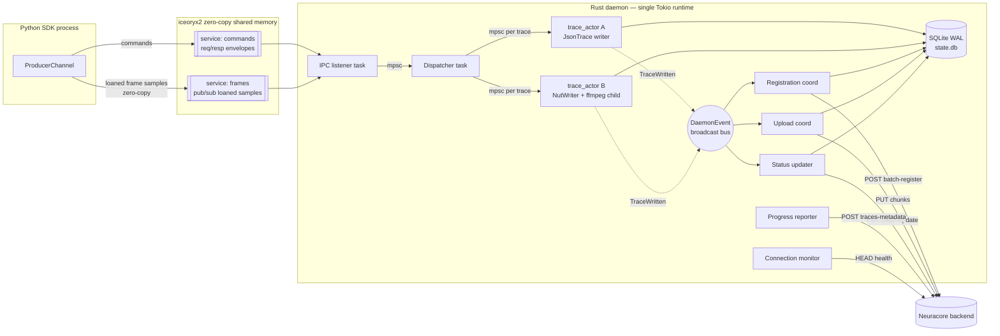
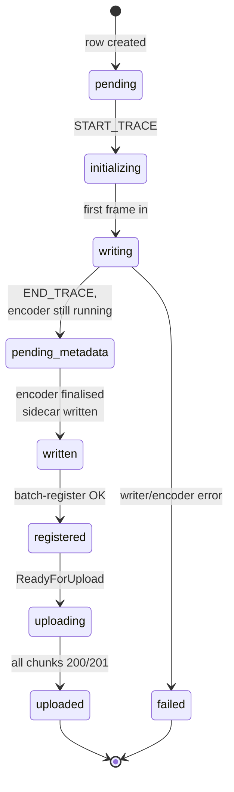
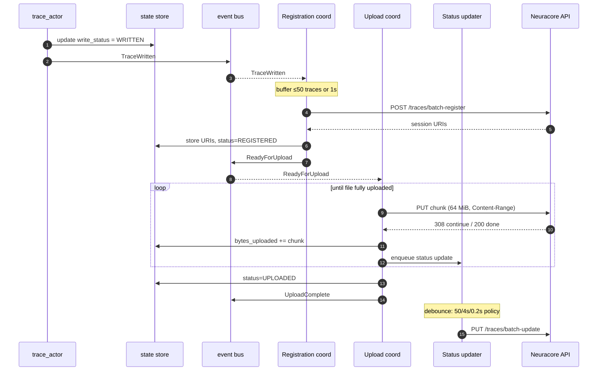

# Rust Rewrite of the Data Daemon — Architecture & Implementation Plan

<!-- cSpell:disable  -->
## Context

The data daemon today is a Python service ([neuracore/data_daemon/](neuracore/data_daemon/)) that:

- Receives sensor frames + video from the SDK over a control socket (ZMQ) and shared-memory slots.
- Buffers, batches, and encodes them into per-trace `trace.json`, `lossy.mp4`, and `lossless.mp4` files on disk.
- Tracks lifecycle state in SQLite, then batch-registers traces and resumable-uploads files to the Neuracore backend.

The Python implementation has accumulated complexity: two-tier event loops, four spool shards plus four completion shards, a raw batch writer, and a separate batch encoder worker — all coordinating through a mix of asyncio queues, `threading.Queue`, semaphores, locks, and an event emitter ([data_daemon/communications_management/consumer/spool_worker.py](neuracore/data_daemon/communications_management/consumer/spool_worker.py), [data_daemon/event_loop_manager.py](neuracore/data_daemon/event_loop_manager.py)). The threading model is the main pain point.

The rewrite preserves all *external* contracts unchanged so the existing test suite passes byte-for-byte: HTTP API to the backend, CLI commands and flags, environment variables, output file layout and contents, PID-file and signal semantics. The *internal* design — IPC wire format, on-disk staging files, SQLite schema, threading model — is redesigned for simplicity and throughput.

### Hard contracts (unchanged)

| Contract | Source | Notes |
|---|---|---|
| Backend HTTP API | 7 endpoints, see "External API" below | Same paths, bodies, headers, retry policy, status codes |
| CLI commands | `launch`, `stop`, `status`, `profile {create,update,get,delete,list}`, `install`, `uninstall` | [main.py](neuracore/data_daemon/main.py), [args_handler.py](neuracore/data_daemon/config_manager/args_handler.py) |
| Env vars | `NCD_*` (8 profile overrides), `NEURACORE_DAEMON_*` (5 runtime), `NDD_DEBUG`, `NEURACORE_API_URL`, `NCD_MAX_SPOOLED_CHUNKS` | See "Environment variables" below |
| Output trace layout | `~/.neuracore/data_daemon/recordings/{recording_id}/{data_type}/{trace_id}/{trace.json,lossy.mp4,lossless.mp4}` | [const.py:63](neuracore/data_daemon/const.py#L63) |
| Process model | PID file (default `~/.neuracore/daemon.pid`), `/tmp/ndd/management.sock`, SIGTERM = graceful, SIGINT = graceful, SIGKILL recoverable on next launch | [const.py:43-44](neuracore/data_daemon/const.py#L43-L44) |
| Python entrypoint | `python -m neuracore.data_daemon <cmd>` must keep working — test infra invokes it directly | Replace `__main__.py` with a thin shim that `exec`s the Rust binary with the same argv |

### What changes (internal)

- SDK ↔ daemon IPC: replace ZMQ envelopes + `multiprocessing.shared_memory` with **iceoryx2** zero-copy shared-memory services. No Unix socket on disk. Producer-side code in [neuracore/data_daemon/communications_management/producer/](neuracore/data_daemon/communications_management/producer/) is rewritten on top of iceoryx2's Python bindings.
- Encoding: instead of buffering raw bytes through `RawBatchWriter` → `BatchEncoderWorker` → PyAV, the daemon writes raw frames into a per-trace **hand-rolled NUT muxer** on disk; a long-running ffmpeg subprocess reads the NUT and transcodes to `lossy.mp4` (H.264) and `lossless.mp4` (FFV1) in one pass.
- Threading: one Tokio multi-threaded runtime; one actor task per trace; no sharded worker pools.
- SQLite schema: tables (`recordings`, `traces`) defined and migrated via `sqlx`, with **freedom to evolve column names and status enums**. The integration-test DB wait helpers ([wait_for_all_traces_written, wait_for_upload_complete_in_db](tests/integration/platform/data_daemon/) — typically in `shared/db_helpers.py`) are updated in lockstep with the schema so the *behavioural* contract (recording stopped → traces written → traces uploaded → progress reported) is preserved but not the literal column layout.

---

## Architecture

### 1. Crate layout

Location: `rust/data_daemon/` at repo root (parallel to `neuracore/`). Single binary crate.

```
rust/data_daemon/
├── Cargo.toml
├── migrations/                  # sqlx migrations
│   └── 0001_initial.sql
└── src/
    ├── main.rs                  # tokio runtime bootstrap, CLI dispatch
    ├── cli/                     # clap definitions + per-command handlers
    │   ├── mod.rs
    │   ├── launch.rs            # detach, write PID, exec runner
    │   ├── stop.rs              # SIGTERM → wait 10s → SIGKILL
    │   ├── status.rs
    │   └── profile.rs           # create/update/get/delete/list
    ├── config/
    │   ├── mod.rs               # merge profile + env overrides
    │   ├── profile.rs           # YAML profile load/save (matches today's on-disk format)
    │   └── env.rs               # NCD_* parsing (parse_bytes, bools, ints)
    ├── lifecycle/
    │   ├── mod.rs
    │   ├── pidfile.rs           # flock-based single-instance enforcement
    │   ├── daemonize.rs         # double-fork + setsid for background mode
    │   ├── signals.rs           # tokio::signal → shutdown broadcast
    │   └── recovery.rs          # on-startup orphan cleanup (post-SIGKILL)
    ├── ipc/
    │   ├── mod.rs
    │   ├── node.rs              # iceoryx2 Node + service setup
    │   ├── services.rs          # service name conventions + payload types
    │   └── envelope.rs          # serde envelope types for command service
    ├── pipeline/
    │   ├── mod.rs
    │   ├── dispatcher.rs        # route messages → per-trace mpsc
    │   └── trace_actor.rs       # per-trace task: state + writer handle
    ├── encoding/
    │   ├── mod.rs
    │   ├── json_trace.rs        # incremental JSON array writer + chunked flush
    │   ├── nut_writer.rs        # write raw RGB frames to NUT container on disk
    │   ├── video_encoder.rs     # spawn ffmpeg(NUT) → lossy.mp4 + lossless.mp4
    │   └── metadata.rs          # sidecar trace.json for video traces
    ├── state/
    │   ├── mod.rs
    │   ├── store.rs             # StateStore trait + sqlx impl (WAL)
    │   ├── schema.rs            # sqlx::query_as! types
    │   └── events.rs            # tokio::sync::broadcast event bus
    ├── storage/
    │   ├── mod.rs
    │   ├── paths.rs             # recording_id/data_type/trace_id → PathBuf
    │   └── budget.rs            # disk usage accounting + eviction policy
    ├── api/
    │   ├── mod.rs
    │   ├── client.rs            # reqwest::Client with retry middleware
    │   ├── auth.rs              # token cache + 401-refresh
    │   └── models.rs            # request/response serde types
    ├── upload/
    │   ├── mod.rs
    │   ├── registration.rs      # batch register (50/batch)
    │   ├── uploader.rs          # resumable PUT (64 MiB chunks, Content-Range)
    │   ├── status.rs            # batch trace status updates (50/batch, debounced)
    │   └── progress.rs          # periodic traces-metadata report
    ├── connection/
    │   └── monitor.rs           # HEAD /status/health every 10s
    └── observability/
        └── tracing.rs           # tracing-subscriber EnvFilter setup
```

### 2. Library choices

| Concern | Crate | Rationale |
|---|---|---|
| Async runtime | `tokio` (multi-thread) | Mature, work-stealing scheduler replaces sharded thread pools |
| CLI | `clap` v4 (derive) | Mirrors typer command tree directly |
| HTTP | `reqwest` + `rustls-tls` | Async, rustls avoids OpenSSL build hell |
| Retry middleware | `reqwest-retry` + `reqwest-middleware` | Centralised retry policy with backoff |
| SQLite | `sqlx` (sqlite + macros + chrono) | Compile-time checked queries; native async, WAL support |
| Logging | `tracing` + `tracing-subscriber` | Structured logs, `EnvFilter` for `NDD_DEBUG` |
| Serialization | `serde` + `serde_json` | Profiles, envelopes, API bodies |
| IPC (commands + frames) | `iceoryx2` | Zero-copy shared-memory pub/sub + request/response; outperforms UDS by 1–2 orders of magnitude on payload sizes >1 KiB. Python bindings shipped upstream so SDK producer can use it. |
| Token-file watch | `notify` | Watch `~/.neuracore/config.json` for auth-token refresh from the Python SDK |
| FS operations | `tokio::fs`, `nix` for `flock`/`fork`/`setsid` | Required for daemonization + single-instance lock |
| Signals | `tokio::signal::unix` | Async SIGTERM/SIGINT handling |
| Video container | ffmpeg subprocess via `tokio::process` | Reads NUT, writes mp4; no FFI build complexity |
| Time | `chrono` | Match SQLite DATETIME columns; UTC |
| IDs | `uuid` v4 | Match existing trace_id/recording_id semantics |
| Error | `thiserror` (libs) + `anyhow` (bins) | Standard idiom |
| Test helpers | `tempfile`, `assert_fs`, `wiremock` | Unit-test fakes; for integration we use the real Python test suite |

### 3. Threading & async model

One `tokio::runtime::Builder::new_multi_thread()` runtime, default worker count = CPU cores. All work runs on this runtime as `tokio::task`s. No raw `std::thread::spawn`. Cross-thread communication via `tokio::sync::{mpsc, broadcast, oneshot}`.



Compared to today: ~10 named threads (4 spool + 4 completion + general loop + various) collapse to a small set of *logical* tasks (listener, dispatcher, per-trace × N, registration, upload, status, progress, monitor), all scheduled on the Tokio worker pool. Per-trace ordering is preserved trivially because each trace has one consumer task.

### 4. Data path — end to end

Numbers refer to the diagram above.

**Ingress (SDK → daemon):**

1. Producer SDK calls `nc.log_*()`. The producer attaches to two iceoryx2 services (created by the daemon): `commands` (request/response for envelopes) and `frames/<resolution>` (pub/sub for RGB frame samples). For joint/scalar data it serialises a command envelope and `send_copy`s it on the commands service. For RGB frames it `loan_uninit`s a sample sized for the frame, writes pixel bytes directly into the loaned buffer, then `send`s — no copy.
2. The daemon's listener task `recv`s on both services in a `select!` loop using iceoryx2's tokio integration (or a small adaptor that wraps iceoryx2's WaitSet into a `tokio::sync::Notify`). Each received sample yields a parsed envelope.
3. Listener forwards parsed envelopes into the dispatcher `mpsc::Sender`. For frame samples it holds the iceoryx2 `Sample` until the trace_actor has copied/written the bytes, then drops it — releasing the shared-memory slot back to the SDK's pool automatically. Command-service requests get a tiny ACK/error response via the iceoryx2 response channel; this replaces today's `/tmp/ndd/slot_acks/*.ipc` files entirely.

**Routing & per-trace processing:**

4. Dispatcher receives envelopes, looks up the per-`(recording_id, trace_id, data_type)` actor in a `DashMap`. On first message, it creates the actor: spawns a task, reserves a `mpsc::channel(bounded=64)`, opens the JSON/NUT writer.
5. Per-trace actor consumes messages serially:
   - `START_TRACE` — insert trace row in DB (status `INITIALIZING`), open writer.
   - `FRAME` (JSON) — append entry to in-memory buffer; if buffer ≥ 4 MiB, flush to `trace.json`. Update `bytes_written` in DB periodically (debounced).
   - `FRAME` (RGB) — append to NUT writer; if encoder not yet running and we have ≥1 frame, spawn ffmpeg with `-i raw.nut -c:v libx264 lossy.mp4 -c:v ffv1 lossless.mp4` (one process, two outputs). Encoder reads NUT as it grows.
   - `END_TRACE` — flush JSON; for video, close NUT, wait for ffmpeg to finish, write `metadata.json` sidecar (frame array). Update row to `WRITTEN`. Emit `TraceWritten` event.
6. Drop the actor entry from the dispatcher map after a short grace.

**Egress (daemon → cloud):**

7. **Registration coordinator** subscribes to `TraceWritten`. Buffers up to 50 traces or 1s timeout, then POSTs `/org/{org}/recording/traces/batch-register` with `cloud_files` list. Stores returned upload session URIs in the DB, updates `registration_status` to `REGISTERED`. Emits `ReadyForUpload`.
8. **Upload coordinator** subscribes to `ReadyForUpload`. For each trace, opens the on-disk files and PUTs them resumably in 64 MiB chunks to the session URIs (200/201 → done, 308 → continue, 410 → fetch new URI, 401 → refresh token then retry). Updates `bytes_uploaded` in DB; emits status updates on a debounced `BatchUpdate` channel.
9. **Status updater** subscribes to `BatchUpdate` events. Flushes every 50 traces, or every 4 s for in-progress, or every 0.2 s if a completion is queued — exact same policy as today's [trace_status_updater.py:168](neuracore/data_daemon/upload_management/trace_status_updater.py#L168). PUTs `/recording/{rec_id}/traces/batch-update`.
10. **Progress reporter** runs on a 30 s tick: POSTs `/recording/{rec_id}/traces-metadata` with bytes-uploaded snapshot per trace until `progress_reported = 'reported'`.
11. **Connection monitor** runs on a 10 s tick: HEAD `/status/health`; pauses uploader on persistent failure.

### 5. State management

SQLite at `NEURACORE_DAEMON_DB_PATH` (default `~/.neuracore/data_daemon/state.db`). WAL mode, `synchronous=NORMAL`, `busy_timeout=1000`.

**Schema is flexible.** Column names and status strings below are a starting point; we're free to evolve them as the rewrite proceeds (e.g. fold `registration_status` + `upload_status` into a single ordered `lifecycle_state`, drop fields that the daemon now derives, add a `session_uris JSONB` column). The corresponding integration-test wait helpers — `wait_for_all_traces_written`, `wait_for_upload_complete_in_db`, and `fetch_recording_online_verification_stats` in [tests/integration/platform/data_daemon/shared/db_helpers.py](tests/integration/platform/data_daemon/) — are updated in the same PR so they query the new shape. The *behavioural* invariants the tests care about (stopped recording → all traces fully written on disk → all traces uploaded → progress reported) survive any schema reshuffle.

A reasonable starting schema, kept conceptually close to today's [tables.py](neuracore/data_daemon/state_management/tables.py):

```sql
-- migrations/0001_initial.sql

CREATE TABLE recordings (
    recording_id TEXT PRIMARY KEY,
    org_id TEXT NOT NULL,
    expected_trace_count INTEGER,
    expected_trace_count_reported INTEGER,
    trace_count INTEGER NOT NULL DEFAULT 0,
    uploaded_trace_count INTEGER NOT NULL DEFAULT 0,
    progress_reported TEXT NOT NULL DEFAULT 'pending',   -- pending|reporting|reported
    stopped_at DATETIME,
    created_at DATETIME NOT NULL,
    last_updated DATETIME NOT NULL
);

CREATE TABLE traces (
    trace_id TEXT PRIMARY KEY,
    recording_id TEXT NOT NULL REFERENCES recordings(recording_id),
    write_status TEXT NOT NULL DEFAULT 'pending',          -- pending|initializing|writing|pending_metadata|written|failed
    registration_status TEXT NOT NULL DEFAULT 'pending',   -- pending|registering|registered|retrying|failed
    upload_status TEXT NOT NULL DEFAULT 'pending',         -- pending|queued|uploading|paused|uploaded|retrying|failed
    data_type TEXT NOT NULL,
    data_type_name TEXT,
    dataset_id TEXT,
    dataset_name TEXT,
    robot_name TEXT,
    robot_id TEXT,
    robot_instance INTEGER,
    path TEXT,
    bytes_written INTEGER NOT NULL DEFAULT 0,
    total_bytes INTEGER NOT NULL DEFAULT 0,
    bytes_uploaded INTEGER NOT NULL DEFAULT 0,
    error_code TEXT,
    error_message TEXT,
    num_upload_attempts INTEGER NOT NULL DEFAULT 0,
    next_retry_at DATETIME,
    created_at DATETIME NOT NULL,
    last_updated DATETIME NOT NULL
);

CREATE INDEX idx_traces_recording ON traces(recording_id);
CREATE INDEX idx_traces_write ON traces(write_status);
CREATE INDEX idx_traces_registration ON traces(registration_status);
CREATE INDEX idx_traces_upload ON traces(upload_status);
CREATE INDEX idx_traces_retry ON traces(next_retry_at);
```

The integration tests query these columns directly ([db_helpers.py wait_for_all_traces_written, wait_for_upload_complete_in_db](tests/integration/platform/data_daemon/) — see test exploration in conversation). The column names and enum string values are part of the test contract and must match.

Writes serialised via a `tokio::sync::Mutex<SqlitePool>` write guard around `BEGIN; ...; COMMIT;` blocks — mirrors the `asyncio.Semaphore(1)` pattern at [state_store_sqlite.py:63](neuracore/data_daemon/state_management/state_store_sqlite.py#L63).

**Event bus.** `tokio::sync::broadcast::channel(256)` carrying `enum DaemonEvent { TraceWritten, TraceRegistered, ReadyForUpload, UploadComplete, RecordingStopped, ... }`. Subscribers (registration coordinator, upload coordinator, etc.) hold a `Receiver`.

**Trace lifecycle** (per-trace state machine; the labels are illustrative — the test gate only requires the terminal states):



**Cloud handoff sequence** (after a trace is written on disk):



### 6. Encoding pipeline

**JSON traces** ([json_trace.rs](rust/data_daemon/src/encoding/json_trace.rs)):

- Open `trace.json` for write, write `[`.
- On `add_frame(entry)`: serialize JSON, prefix `,` if not first, append to in-memory `BytesMut`. When buffer ≥ `DEFAULT_FLUSH_BYTES` (4 MiB, [const.py:55](neuracore/data_daemon/const.py#L55)), flush to file.
- On finalize: flush, write `]`, close. Update `total_bytes` in DB.

**Video traces** ([nut_writer.rs](rust/data_daemon/src/encoding/nut_writer.rs) + [video_encoder.rs](rust/data_daemon/src/encoding/video_encoder.rs)):

- Each video trace gets a working directory: `{recordings_root}/{recording_id}/RGB/{trace_id}/`.
- The trace_actor writes incoming RGB frames into `raw.nut` in that directory using a minimal NUT muxer. NUT is well-suited: it's an open container format that supports growing files and arbitrary raw video streams. We write headers on first frame (resolution, pix_fmt, timebase from frame metadata), then append packets per frame.
- On first frame (or, optionally, on trace end), spawn ffmpeg:
  ```
  ffmpeg -y -fflags +genpts -i raw.nut \
      -map 0:v -c:v libx264 -preset veryfast -crf 23 lossy.mp4 \
      -map 0:v -c:v ffv1 lossless.mp4
  ```
  ffmpeg reads NUT incrementally as it grows. Trace_actor signals end-of-input by closing the NUT file with its final packet.
- On encoder exit, write `trace.json` sidecar containing the frame metadata array (timestamps, dimensions, etc.) the way [video_trace.py](neuracore/data_daemon/recording_encoding_disk_manager/encoding/video_trace.py) does today.
- Delete `raw.nut` after both mp4s are verified non-empty.

Frame metadata accumulator buffers in memory (one dict per frame, ~few hundred bytes) and is flushed only at finalize — total memory bounded by frame count.

NUT-on-disk acts as the per-trace ring buffer / spool: durable, can be re-read after a crash for partial recovery, and we no longer need an in-memory chunk buffer or a separate "raw batch writer + batch encoder" pair.

### 7. IPC redesign — iceoryx2

The Unix socket at `/tmp/ndd/management.sock` is **gone**. The bespoke `/tmp/ndd/slot_acks/*.ipc` files are **gone**. All SDK ↔ daemon traffic moves over [iceoryx2](https://github.com/eclipse-iceoryx/iceoryx2) services. iceoryx2 manages its own shared-memory layout under its config root (typically `/tmp/iceoryx2/` on Linux, `${TMPDIR}/iceoryx2/` on macOS); cleanup is via iceoryx2's own discovery + node-removal APIs.

**Services** (all created by the daemon at startup, opened by the SDK on `nc.login()` / first `log_*` call):

| Service name | Pattern | Payload | Purpose |
|---|---|---|---|
| `neuracore/data_daemon/commands` | request/response | request: `Command` enum (serde-encoded fixed-size buffer), response: `Ack` or `Err` | All lifecycle envelopes: start/stop/cancel recording, start/end trace, register producer |
| `neuracore/data_daemon/scalars` | pub/sub | `ScalarFrame { trace_id, timestamp, payload_len, payload[N] }` (sized for max JSON entry) | Joint / sensor / event data |
| `neuracore/data_daemon/frames/<WxH>` | pub/sub | `VideoFrame { trace_id, timestamp, width, height, stride, pixels[W*H*3] }` per-resolution service | Zero-copy RGB frames; loaned by SDK, never copied |

```rust
// rust/data_daemon/src/ipc/envelope.rs
#[derive(Serialize, Deserialize)]
enum Command {
    Hello { producer_id: String, capabilities: Vec<String> },
    StartRecording { recording_id: String, robot_id: String, /* … */ },
    StartTrace { recording_id: String, trace_id: String, data_type: String, /* … */ },
    EndTrace { trace_id: String },
    StopRecording { recording_id: String },
    CancelRecording { recording_id: String },
    OpenFrameStream { trace_id: String, width: u32, height: u32 },
}

#[derive(Serialize, Deserialize)]
enum Response { Ack { sequence: u64 }, Err { code: String, message: String } }
```

**Why iceoryx2 wins here**: video frames at 30 fps × 1920×1080 × 3 bytes = ~178 MiB/s per camera. With Unix sockets we'd copy that through kernel buffers. With iceoryx2's `loan` API the SDK writes pixel bytes *directly into the shared-memory sample* the daemon will read; no kernel hop, no copy, sub-microsecond hand-off. The daemon's per-trace actor takes ownership of the `Sample<VideoFrame>`, appends the bytes to the NUT writer (one `write_all` into the on-disk NUT file), and drops the sample — releasing the slot back to the SDK's loan pool.

**Backpressure**: iceoryx2 publishers have a configurable queue depth per subscriber. When the daemon is slow, the SDK's `loan` blocks (or returns `LoanError::ExceedsMaxLoanedSamples`) — natural backpressure without manual slot accounting.

**Discovery & lifecycle**: daemon creates a `Node` named `neuracore-data-daemon-{pid}` and the three services as part of Phase 4 (the IPC bring-up was originally pencilled into Phase 2 but deferred so the producer rewrite, dispatcher, and service creation can land together). SDK opens by name. On daemon shutdown, the node is `drop`ped, which `iceoryx2` cleans up (discovery files removed). On SIGKILL, stale node files are reaped by iceoryx2's automatic dead-node detection (next daemon start triggers reclamation). The integration tests' "socket unlinked" assertion ([test_signal_cleanup.py](tests/integration/platform/data_daemon/behavioural_correctness/test_signal_cleanup.py)) is rewritten to check "no `iceoryx2` node files remain under the daemon's node prefix" — same shape of assertion, different artefact — and the IPC-shaped assertions are gated to Phase 4.

**SDK producer rewrite scope.** [neuracore/data_daemon/communications_management/producer/producer_channel.py](neuracore/data_daemon/communications_management/producer/producer_channel.py) and its companions are rewritten on top of [iceoryx2's Python bindings](https://iceoryx.io/v2.0.5/getting-started/examples/python/) (`iceoryx2-py`). The producer-side public API (`ProducerChannel.send_batched_data`, etc.) is preserved so [neuracore/core/streaming/data_stream.py](neuracore/core/streaming/data_stream.py) is unaffected. Risk: iceoryx2's Python binding is younger than the Rust API; mitigation noted in "Open items".

### 8. External API (preserved verbatim)

Endpoints and behaviour are **unchanged**. Tabulated here so the Rust client modules can be checked against the existing contract.

| Method & path | Purpose | Source today | Notes |
|---|---|---|---|
| `HEAD {API_URL}/status/health` | Connectivity probe, 10 s interval | [connection_manager.py:96](neuracore/data_daemon/connection_management/connection_manager.py#L96) | Connected iff status < 500 |
| `POST /org/{org}/recording/traces/batch-register` | Batch register traces | [registration_manager.py:290](neuracore/data_daemon/registration_management/registration_manager.py#L290) | Body: `traces:[{recording_id, data_type, trace_id, cloud_files:[{filepath, content_type}]}]` |
| `GET /org/{org}/recording/{rec}/resumable_upload_url?filepath=…&content_type=…` | Session URI fetch | [resumable_file_uploader.py:130](neuracore/data_daemon/upload_management/resumable_file_uploader.py#L130) | 401 → refresh token, retry once |
| `PUT <session_uri>` | Resumable chunk (GCS-compatible) | [resumable_file_uploader.py:315](neuracore/data_daemon/upload_management/resumable_file_uploader.py#L315) | `Content-Range: bytes a-b/total` or `*/total`; 200/201 done, 308 continue, 410 expired, 403/404 fatal |
| `PUT /org/{org}/recording/{rec}/traces/batch-update` | Trace status batch | [trace_status_updater.py:168](neuracore/data_daemon/upload_management/trace_status_updater.py#L168) | Up to 50/batch, debounced |
| `POST /org/{org}/recording/{rec}/traces-metadata` | Progress report | [progress_reporter.py:57](neuracore/data_daemon/progress_reporter.py#L57) | Body `{traces: {trace_id: bytes_uploaded}}` |
| `GET /org/{org}/recording/{rec}/expected-trace-count` | Validation | state_manager flow | Optional, validation only |

Retry policy: `BACKEND_API_MAX_RETRIES=3`, backoff cap 30 s, retryable on `{408,425,429,500,502,503,504}`. Upload retries: `UPLOAD_MAX_RETRIES=5`, base 2 s, cap 300 s ([const.py:74-80](neuracore/data_daemon/const.py#L74-L80)).

Auth: bearer header from `get_auth().get_headers()`. The Rust client will look up the same token store on disk (or re-read the auth.json file the Python `auth` module manages) — token *refresh* logic stays in Python and is called via a small helper if needed. Simpler: the Rust client reads the same token file that the Python SDK writes (`~/.neuracore/config.json` / equivalent) and on 401 invokes the SDK's refresh CLI (or reads a refreshed token from the file).

### 9. CLI & environment variables (preserved verbatim)

CLI tree (clap derive):

```
data-daemon
  launch  [--profile <name>] [--background] [--debug]
  stop
  status
  install      # emit "not implemented yet" for parity
  uninstall    # emit "not implemented yet" for parity
  profile
    create <name>
    update [<name>] [--storage-limit ...] [--bandwidth-limit ...]
                    [--storage-path ...] [--num-threads ...]
                    [--wakelock|--no-wakelock] [--offline|--online]
                    [--api-key ...] [--current-org-id ...]
    get   [<name>]
    delete <name>
    list
```

Environment variables (verbatim names from [config.py:12](neuracore/data_daemon/config_manager/config.py#L12), [const.py](neuracore/data_daemon/const.py), [helpers.py](neuracore/data_daemon/helpers.py)):

- Profile overrides: `NCD_STORAGE_LIMIT`, `NCD_BANDWIDTH_LIMIT`, `NCD_PATH_TO_STORE_RECORD`, `NCD_NUM_THREADS`, `NCD_KEEP_WAKELOCK_WHILE_UPLOAD`, `NCD_OFFLINE`, `NCD_API_KEY`, `NCD_CURRENT_ORG_ID`.
- Runtime: `NEURACORE_DAEMON_PID_PATH`, `NEURACORE_DAEMON_DB_PATH`, `NEURACORE_DAEMON_MANAGE_PID`, `NEURACORE_DAEMON_PROFILE`, `NEURACORE_DAEMON_RECORDINGS_ROOT`.
- Misc: `NDD_DEBUG`, `NEURACORE_API_URL`, `NCD_MAX_SPOOLED_CHUNKS`.

Defaults preserved: `NEURACORE_API_URL` → `https://api.neuracore.app/api`, recordings root → `~/.neuracore/data_daemon/recordings`, DB path → `~/.neuracore/data_daemon/state.db`, PID file → `~/.neuracore/daemon.pid`, socket → `/tmp/ndd/management.sock`.

### 10. Python shim

[neuracore/data_daemon/__main__.py](neuracore/data_daemon/__main__.py) is replaced with:

```python
import os
import sys
from importlib.resources import files

binary = files("neuracore.data_daemon").joinpath("bin/data-daemon")
os.execv(str(binary), [str(binary), *sys.argv[1:]])
```

The Rust binary is built per-platform and shipped as a wheel data file via `maturin` (or a setuptools custom step). The test infrastructure invocation `python -m neuracore.data_daemon stop` continues to work transparently.

---

## Implementation Plan

Eight phases. Each phase has a *deliverable* (what must exist), an *integration-test gate* (which of the 18 tests in [tests/integration/platform/data_daemon/](tests/integration/platform/data_daemon/) it should unblock), and a *check* (how to confirm we're on track). Estimated time assumes one engineer full-time; phases 3–5 can parallelise with two.

### Phase 1 — Scaffolding & CLI parity (2 days)

**Build:**
- `cargo init` at `rust/data_daemon/`. Wire workspace + CI.
- clap CLI matching the typer tree exactly (commands, flag names, help strings).
- `config/profile.rs` reads/writes YAML profiles at `~/.neuracore/data_daemon/profiles/{name}.yaml`. Same fields as today's `Profile` dataclass. YAML on disk (rather than JSON) matches the existing Python `ProfileManager` and is a hard contract: the integration tests write profile YAML directly (e.g. [tests/integration/platform/data_daemon/shared/profiles.py::scoped_offline_profile](tests/integration/platform/data_daemon/shared/profiles.py)) and expect the daemon to read it. `profile get` still emits JSON to stdout for parity with Python's `model_dump_json(indent=2)`.
- `config/env.rs` parses all `NCD_*` and runtime env vars; merges with profile.
- Python shim in `__main__.py` (behind a feature flag so the Python daemon can still be invoked for the rollout window).

**Deliverable:** `cargo run -- profile list`, `profile create foo`, `profile update foo --storage-limit 1G`, `profile get foo` all behave identically to today's typer CLI (compare outputs).

**Test gate:** Phase exposes nothing user-facing yet; verified by direct CLI comparison against today's `python -m neuracore.data_daemon profile *`.

**Check:** golden-file CLI tests pass.

### Phase 2 — Daemon lifecycle (2–3 days)

**Build:**
- `lifecycle/daemonize.rs`: double-fork + setsid for `--background`; foreground mode for non-background.
- `lifecycle/pidfile.rs`: `flock` on the PID file path from `NEURACORE_DAEMON_PID_PATH`; write PID; clean up on shutdown.
- `lifecycle/signals.rs`: install SIGTERM and SIGINT handlers that fire a `tokio::sync::broadcast::Sender<()>` shutdown signal.
- `lifecycle/recovery.rs`: on startup, sweep a stale PID file left by a previous SIGKILL (next acquire also recovers via `flock` alone, but eager cleanup keeps `status` / external diagnostics accurate). The iceoryx2 dead-node sweep lands in Phase 4 alongside the actual `Node` bring-up; until then `cleanup_stale_ipc` is a no-op placeholder.

**Deliverable:** `launch --background` returns, prints PID; `stop` sends SIGTERM and cleans up the PID file; `status` reads PID file and reports.

**Test gate:** the lifecycle-only cases in [test_signal_cleanup.py](tests/integration/platform/data_daemon/behavioural_correctness/test_signal_cleanup.py) pass — CLI stop, SIGTERM, SIGINT, SIGKILL recovery, restart idempotency, etc. The iceoryx2-node assertions migrate alongside the Phase 4 IPC bring-up (see below); any assertion that requires a live IPC service is gated on Phase 4 in the meantime.

**Check:** `pytest tests/integration/platform/data_daemon/behavioural_correctness/test_signal_cleanup.py -x` is green.

### Phase 3 — SQLite state store (1–2 days)

**Build:**
- sqlx migration `0001_initial.sql` (schema above).
- `state/store.rs` `StateStore` trait with `create_recording`, `create_trace`, `update_trace`, `claim_traces_for_registration`, etc. — mirrors today's [state_store.py](neuracore/data_daemon/state_management/state_store.py) Protocol.
- `state/events.rs` broadcast channel.
- Apply WAL pragmas on connection init.

**Deliverable:** unit tests on a tempfile SQLite. Running the binary creates the schema.

**Test gate:** internal only this phase.

**Check:** `cargo test -p data-daemon state::` green; can dump DB after a launch and see empty schema.

### Phase 4 — IPC + per-trace pipeline (3–4 days)

**Build:**
- Bring up the iceoryx2 `Node` (`neuracore-data-daemon-{pid}`) and create the three services (`commands`, `scalars`, `frames/<WxH>`) — originally slated for Phase 2 but deferred here so the IPC, dispatcher, and producer rewrite land together.
- `lifecycle/recovery.rs`: extend `cleanup_stale_ipc` to call `Node::cleanup_dead_nodes` and reap any discovery files left by a SIGKILL'd predecessor.
- `ipc/node.rs`, `ipc/services.rs`, `ipc/envelope.rs`: serde types for commands and ACKs; service name conventions.
- `pipeline/dispatcher.rs`: `DashMap<TraceKey, mpsc::Sender<TraceMessage>>`; on first message, spawn trace_actor.
- `pipeline/trace_actor.rs`: skeletal — receives messages, logs them, updates DB row, sends ACK back. No encoding yet.
- Rewrite the Python producer ([neuracore/data_daemon/communications_management/producer/producer_channel.py](neuracore/data_daemon/communications_management/producer/producer_channel.py)) to speak the new protocol. Keep the public API the same.

**Deliverable:** a smoke test (Python SDK → daemon) showing a START_TRACE → 100 FRAME → END_TRACE round-trip creates a trace row that transitions to `WRITTEN` (with no on-disk file yet).

**Test gate:** internal smoke test; partial pass of `test_startup.py` (single-instance guarantee survives because of phase 2).

**Check:** can run two terminal sessions — daemon in one, a small Python `produce.py` in the other — and see DB rows appearing.

### Phase 5 — Encoding (3–4 days)

**Build:**
- `encoding/json_trace.rs`: incremental JSON-array writer with 4 MiB flush threshold.
- `encoding/nut_writer.rs`: minimal NUT muxer that supports our raw RGB frames (one video stream, append-only).
- `encoding/video_encoder.rs`: spawn ffmpeg subprocess per video trace, supervise; on completion, finalize.
- `encoding/metadata.rs`: video sidecar `trace.json`.
- `storage/paths.rs`: path resolution.
- `storage/budget.rs`: tracked free-space accounting; pause writes when below `MIN_FREE_DISK_BYTES` (32 MiB, [const.py:57](neuracore/data_daemon/const.py#L57)).
- Wire trace_actor to actual writers.

**Deliverable:** offline-mode recordings produce identical-shape files to today: `recordings/{rec}/RGB/{trace}/{lossy.mp4, lossless.mp4, trace.json}` and `recordings/{rec}/{data_type}/{trace}/trace.json`.

**Test gate:** all 8 cases of [data_integrity/test_pre_network.py::test_disk_db_data_integrity](tests/integration/platform/data_daemon/data_integrity/test_pre_network.py) pass — verifies on-disk timestamps, monotonicity, expected duration windows, frame counts.

**Check:** `pytest tests/integration/platform/data_daemon/data_integrity/test_pre_network.py -x` green.

### Phase 6 — Cloud upload pipeline (3–4 days)

**Build:**
- `api/client.rs`: `reqwest::Client` + `reqwest-retry` with status-code-aware retry; bearer auth header.
- `api/auth.rs`: read token from `~/.neuracore/config.json`; on 401 invoke refresh (call Python helper or re-read the file after the SDK refreshes; pick the simpler one).
- `upload/registration.rs`: batch-register subscriber on `TraceWritten`; up to 50/batch, 1 s debounce.
- `upload/uploader.rs`: resumable PUT with `Content-Range` and 64 MiB chunks; 308 continuation, 410 session refresh, MD5/x-goog-hash verification.
- `upload/status.rs`: batch trace-status updates with the exact debounce policy from today (50 traces / 4 s in-progress / 0.2 s completion).
- `upload/progress.rs`: periodic `traces-metadata` POST.
- `connection/monitor.rs`: 10 s health check; pauses uploader on failure.

**Deliverable:** offline-recorded local data uploads to the platform when the daemon comes online. Trace rows move `pending → registered → queued → uploading → uploaded`.

**Test gate:** [data_integrity/test_network.py::test_cloud_data_integrity](tests/integration/platform/data_daemon/data_integrity/test_network.py) (8 cases) and [behavioural_correctness/test_offline_to_online.py](tests/integration/platform/data_daemon/behavioural_correctness/test_offline_to_online.py) pass.

**Check:** `pytest tests/integration/platform/data_daemon/data_integrity/test_network.py -x` and `test_offline_to_online.py -x` green. Daemon DB shows `progress_reported='reported'` for each recording.

### Phase 7 — Performance & edge cases (2–3 days)

**Build:**
- `lifecycle/recovery.rs` extension: after SIGKILL mid-recording, clean up partially-written trace rows (mark `failed` if `last_updated` older than ~30 s and `write_status='writing'`).
- Cancel recording handling: drop in-flight trace_actor channels, delete on-disk files, mark recording as cancelled (no upload).
- Tune `mpsc::channel` capacities, NUT writer buffer sizes, JSON flush threshold against [performance/test_pre_network.py PRE_NETWORK_PERFORMANCE_CASES](tests/integration/platform/data_daemon/performance/test_pre_network.py): 60 s @ 210 Hz joints, 8 parallel contexts × 30 fps 256×256 video, 1000-channel high-dimensionality, 300 s 1080p.
- Storage budget enforcement: stop accepting frames when over limit; emit warning.
- Wakelock: if `NCD_KEEP_WAKELOCK_WHILE_UPLOAD=1`, hold a wakelock during active uploads (Linux: nothing special; macOS: `caffeinate`-equivalent — out of scope if non-Linux not required).

**Deliverable:** All 18 integration tests green.

**Test gate:** `pytest tests/integration/platform/data_daemon -x` end-to-end.

**Check:** full integration suite green. Performance cases meet timing budgets (timer stats reported in [conftest.py::pytest_terminal_summary](tests/integration/platform/data_daemon/conftest.py)).

### Phase 8 — Hardening & rollout (2 days)

**Build:**
- Long-soak: run the 300 s 1080p performance case for ≥1 hour, watch RSS and FD count.
- Packaging: `maturin develop` produces the Python wheel embedding the Rust binary. CI matrix for at least Linux x86_64 (and aarch64 if needed).
- Replace [neuracore/data_daemon/__main__.py](neuracore/data_daemon/__main__.py) with the shim; gate behind a feature flag for staged rollout if desired.
- Update CI to build the Rust binary as part of the wheel build.
- ONBOARDING / README updates pointing at the new crate.

**Deliverable:** wheels build green in CI on supported platforms; soak passes; ready to merge.

**Test gate:** CI green on the full integration test job.

**Check:** PR opened; release notes drafted.

---

## Tracking — how do we know we're on track?

Two visible signals each week:

1. **Test gate position.** The number of integration tests passing must monotonically increase across phases: 0 → lifecycle-only cases of `test_signal_cleanup.py` (after phase 2; the iceoryx2-shaped assertions in that file gate on phase 4) → all 14 of `test_signal_cleanup.py` (after phase 4) → +1 in pytest test-count terms but +8 parametrized cases for `test_pre_network.py::test_disk_db_data_integrity` (after phase 5) → ~17 → 18. Track via the same CI job that runs the integration tests today.
2. **Phase deliverable demo.** Each phase ends with a recorded demo: phase 2 = signal cleanup loop; phase 4 = Python smoke-test producer talking to Rust daemon; phase 5 = on-disk file diff against Python daemon output; phase 6 = first dataset on staging.

Red flags:

- If phase 5 takes >5 days, NUT-on-disk pipeline is harder than expected — fall back to ffmpeg stdin pipe (simpler initial step, but loses crash-safety benefit).
- If phase 6 cloud tests fail with auth issues, the token-file approach is wrong; promote auth refresh to a small subprocess to the Python SDK as a stopgap.
- If phase 7 performance cases regress vs Python baseline, profile the trace_actor — the most likely culprit is JSON flush coupling.

---

## Verification — end-to-end test plan

After phase 7, before merge:

1. `cargo build --release -p data-daemon` and install via `maturin develop`.
2. Wipe state: `rm -rf ~/.neuracore/data_daemon /tmp/ndd`.
3. Run the full integration suite: `pytest tests/integration/platform/data_daemon -v`.
4. Run the performance cases with timer logging enabled and compare against baseline numbers logged in `pytest_terminal_summary` from today's Python daemon.
5. Soak: leave a long-running 1080p recording running for ≥1 h; verify no FD leaks (`ls /proc/$(cat ~/.neuracore/daemon.pid)/fd | wc -l` stable) and steady RSS.
6. Restart loop: 100× `launch → small recording → stop`. Verify no stale `/tmp/ndd/management.sock` or PID file remains.

---

## Open items / decisions deferred

- **Auth token refresh.** The simplest path is for the Rust client to *re-read* the token file after a 401, relying on the Python SDK or another process to refresh it. If we need self-contained refresh, port `neuracore.core.auth` minimally. Recommend the file-watch approach for v1.
- **macOS / Windows support.** Today's Python daemon presumably runs on Linux only (the `/tmp/ndd/`, POSIX shm). The Rust rewrite is Linux-first. Confirm before phase 8 whether non-Linux must be supported.
- **NUT muxer crate vs hand-rolled.** Hand-rolling a tiny NUT muxer for one raw-video stream is ~200 lines; alternatives are no crates (NUT is rare in Rust). Plan assumes hand-rolled.
- **install / uninstall CLI subcommands.** Today these are stubs ("not implemented yet"). Plan preserves that behaviour. Confirm OK.
