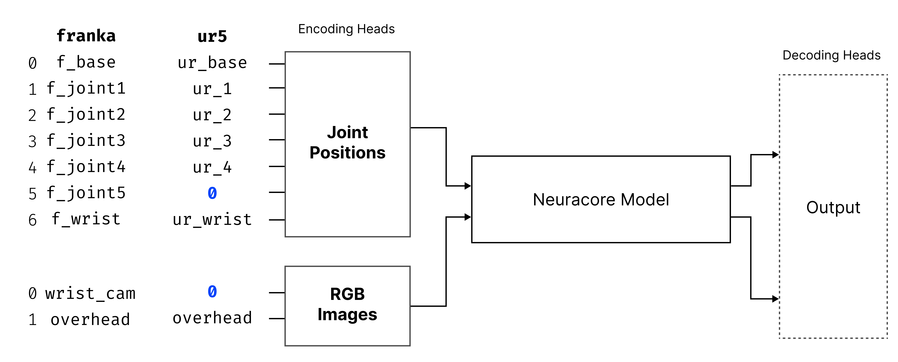

# Model Construction

## The Problem

It usually begins with a single robot. You train a model on a Franka Emika Panda (7 joints), define the input tensors, fix the output dimensionality, and everything works as expected. The model converges, inference is stable, and the system feels clean and well-structured. At this stage, the architecture appears robot-agnostic, but in reality, it is tightly coupled to one embodiment.

Then a second dataset is introduced, perhaps from a UR5 (6 joints). On the surface, the robots are similar: both are industrial manipulators with wrist joints and RGB inputs. But under the hood, the differences begin to surface. Joint names differ. Franka has one extra joint (7 vs 6). Camera placements are not identical. The ordering of data points in the logs does not match. Even wrist joint data may be represented differently.

At first, the solution is incremental. You reorder tensors. You insert padding. You add a mapping layer. You write conditionals in the inference code. The pipeline still runs. But now structure has started leaking. The model input definition is no longer cleanly separated from embodiment logic.

When a third robot arrives, the fragility becomes obvious. Tensor shapes change again. Camera counts differ. The inference pipeline grows conditional branches. Assumptions that were once implicit become scattered across preprocessing scripts and model wrappers. What was intended to be a general system slowly becomes a collection of embodiment-specific patches.

The true bottleneck was never model capacity or optimization strategy. It was representation alignment.

## What Neuracore Changes

Neuracore addresses this problem by making structure explicit and declarative. Instead of allowing each robot to implicitly define tensor layout, Neuracore requires a specification that formally defines how data points map into a shared index space. That specification becomes the single source of truth for model construction.

Rather than hard-coding tensor dimensions into model definitions, Neuracore derives input and output dimensionality directly from the declared robot data specification. The specification defines index positions, and index positions define semantic meaning. Once defined, this layout becomes fixed for the lifetime of the model.

Model shape is therefore spec-driven, not robot-driven.

This shift is subtle but fundamental. The model architecture no longer depends on whichever robot happened to be used first. It depends on a stable, cross-embodiment description.

> [!IMPORTANT]
> **Model shape is spec-driven, not robot-driven.** The training spec defines the fixed tensor layout used for both training and inference.


## Starting a Training Job

When launching a training job in Neuracore, you define:
- Input Cross-Embodiment Description
- Output Cross-Embodiment Description

Other parameters exist (optimizer, architecture, dataset, etc.), but these two specs determine the model input and output dimensionality.

The model shape is not hard-coded. It is constructed deterministically from the specification.

> [!NOTE]
> **Input/Output Embodiment Descriptions control the dimensionality** for the model.

## What Is a Cross Embodiment Description?

```python
EmbodimentDescription = dict[DataType, dict[int, str]]
CrossEmbodimentDescription = dict[str, EmbodimentDescription]
```

We use explicit terminology to clarify intent.

`EmbodimentDescription` describes one robot's data structure.

`CrossEmbodimentDescription` maps robot names to their embodiment descriptions.

This distinction matters because model construction operates across embodiments, not just within one robot.

> [!TIP]
> Keep this distinction clear:
> - `EmbodimentDescription` = one robot
> - `CrossEmbodimentDescription` = many robots

Even for a single robot, you must provide a CrossEmbodimentDescription — it will simply contain one robot (Embodiment) entry.

### EmbodimentDescription

An `EmbodimentDescription` defines what data points exist for one robot and where each datapoint lives in index space.

Each `DataType` (for example `JOINTS`, `RGB_IMAGES`, `GRIPPER_JOINT_OPEN_AMOUNT`) maps to:

`dict[int, str]`

Where:
- `int`: deterministic feature index
- `str`: logged key (joint name, camera name, etc.)

Conceptual example:

```python
{
    JOINTS: {
        0: "arm_joint_1",
        1: "arm_joint_2",
        2: "arm_joint_3",
        3: "arm_joint_4",
        4: "arm_wrist_joint",
    },
    RGB_IMAGES: {
        0: "wrist_camera",
        1: "overhead_camera"
    }
}
```

Why explicit indices:
- **Index defines tensor position.**
- **Tensor position defines semantic meaning.**
- If two robots place an equivalent joint at index 2, the model can treat that feature consistently.
- Allows for aligning similar joints across robots.

### CrossEmbodimentDescription

`CrossEmbodimentDescription = dict[str, EmbodimentDescription]`

This maps:
- Robot name -> embodiment structure

Example:

```python
{
    "franka": { ... },
    "ur5": { ... }
}
```

Why this is necessary:
- Multi-robot training needs a shared tensor space.
- Robots differ in joint counts, camera counts, naming conventions, and morphology.

The `CrossEmbodimentDescription` lets Neuracore:
- Compute maximum dimensionality per `DataType`
- Define index ranges
- Apply deterministic zero-padding
- Guarantee fixed input/output tensor shapes


> [!IMPORTANT]
> A shared cross-embodiment index space is what allows one model to train across heterogeneous robots.

## Example

The example below uses the explicit indexed structure described above.
Each robot is an `EmbodimentDescription`, and the full mapping is a `CrossEmbodimentDescription`.

For clarity, input and output specs are identical here. In practice, output specs often represent target data (for example target joints, torques, or end-effector pose) and may differ from input specs.

```python {13,30}
input_cross_embodiment_description: CrossEmbodimentDescription = {
    "franka": {
        JOINT_POSITIONS: {
            0: "f_base",
            1: "f_joint_1",
            2: "f_joint_2",
            3: "f_joint_3",
            4: "f_joint_4",
            5: "f_joint_5",
            6: "f_wrist",
        },
        RGB_IMAGES: {
            0: "f_wrist_camera",
            1: "f_overhead_camera",
        },
    },
    "ur5": {
        JOINT_POSITIONS: {
            0: "ur5_base",
            1: "ur5_1",
            2: "ur5_2",
            3: "ur5_3",
            4: "ur5_4",
            #  Missing Index 5 to make sure wrist is at index 6
            6: "ur5_wrist",
        },
        RGB_IMAGES: {
            # Index 0 is missing as there is no wrist camera
            1: "ur5_overhead_camera", 
        },
    },
}

output_cross_embodiment_description: CrossEmbodimentDescription = input_cross_embodiment_description
```
In this example, Franka contributes all seven joint indices (`0..6`) while UR5 contributes six (`0..5`). That means UR5 does not have a joint corresponding to **index 6**, so that position is unused for UR5 and therefore padded (typically with zeros).

We did this to keep a consistent joint vector size and ordering across all robots used during training.

The model expects a fixed-length input and output vector. That structure is defined by the global training specification, not by any single robot. Some robots may have more joints, some fewer — but the model architecture cannot change shape depending on which robot is being used.

In this example:

- Index 6 exists in the global joint layout because Franka uses it.
- UR5 does not have a joint that maps to index 6.
- Therefore, we leave that index empty and pad it with zero.

This ensures:

- The model always receives the same input dimension.
- Joint meanings stay aligned across robots.

Padding is simply a structural requirement to preserve a shared representation across multiple robots.

> [!NOTE]
> **Empty index slots are expected** when a robot does not populate every position in the global layout.

## Data Padding

Different robots can have different numbers of joints, but training requires a **consistent tensor shape**.
In this example, each joint stays at its globally assigned index, even when some indices are empty for a given robot.

If one robot has fewer joints, Neuracore fills missing dimensions with `0` so all records align to the same width.

> [!TIP]
> Think of zero-padding as a **layout-preserving operation**, not a semantic value.

Reading the table:
- Each row is one recording
- Each column is one joint-position slot
- Missing joints are zero-padded

| Recording ID | Joint ID 0 | Joint ID 1 | Joint ID 2 | Joint ID 3 | Joint ID 4 | Joint ID 5 | Joint ID 6 |
| ------------ | ---------- | ---------- | ---------- | ---------- | ---------- | ---------- | ---------- |
| 1            | f_base     | f_joint_1  | f_joint_2  | f_joint_3  | f_joint_4  | f_joint_5  | f_wrist    |
| 2            | ur5_base   | ur5_1      | ur5_2      | ur5_3      | ur5_4      | **0**      | ur5_wrist  |
| 3            | f_base     | f_joint_1  | f_joint_2  | f_joint_3  | f_joint_4  | f_joint_5  | f_wrist    |
| 4            | f_base     | f_joint_1  | f_joint_2  | f_joint_3  | f_joint_4  | f_joint_5  | f_wrist    |
| 5            | f_base     | f_joint_1  | f_joint_2  | f_joint_3  | f_joint_4  | f_joint_5  | f_wrist    |
| 6            | ur5_base   | ur5_1      | ur5_2      | ur5_3      | ur5_4      | **0**      | ur5_wrist  |
| 7            | ur5_base   | ur5_1      | ur5_2      | ur5_3      | ur5_4      | **0**      | ur5_wrist  |
| 8            | ur5_base   | ur5_1      | ur5_2      | ur5_3      | ur5_4      | **0**      | ur5_wrist  |

The same strategy applies to other data types, including image channels.

When training on cross-embodiment data, it is important to match joints by meaning, not just by name or position in a list.

Joints that perform the same role — for example base rotation, elbow bend, or wrist joint motion — should be placed in the same index of the model’s input and output vectors across all robots.

If this is not done:

- The same model index may represent different motions on different robots.
- The model becomes confused during training.
- Generalisation between robots becomes much weaker.

For cross-robot training to work well, each dimension in the model must represent a consistent physical meaning across all embodiments.

Once padding enforces consistent shapes across recordings and robots, the model can be constructed as shown below.



In this example, input and output specs are the same, so model heads have identical shape.

> [!WARNING]
> Misaligned indices create **label noise across robots** and can significantly reduce generalization.

## Running Inference

For inference, define model input/output order using an `EmbodimentDescription` that directly matches the robot being controlled.

For example, if you trained on `franka` and `ur5` data and want inference on `ur5`:

```python
model_input_embodiment_description: EmbodimentDescription = {
    JOINT_POSITIONS: {
        0: "ur5_base",
        1: "ur5_1",
        2: "ur5_2",
        3: "ur5_3",
        4: "ur5_4",
        #  Missing Index 5 to make sure wrist is at index 6
        6: "ur5_wrist",
    },
    RGB_IMAGES: {
        # Index 0 is missing as there is no wrist camera
        1: "ur5_overhead_camera", 
    },
}

# model_input_embodiment_description follows the JOINTS/RGB_IMAGES order from input_cross_embodiment_description["ur5"]
```

### Inference on a New Robot

Suppose a new inference-time robot `so100` (SO-100, 5 joints) has:

`[so100_joint_1, so100_joint_2, so100_joint_3, so100_joint_4, so100_joint_5]`

Since this robot has fewer joints than both Franka (7) and UR5 (6), we semantically align what exists and leave the remaining indices zero-padded:

| Robot  | Joint ID 0 | Joint ID 1 | Joint ID 2 | Joint ID 3 | Joint ID 4 | Joint ID 5 | Joint ID 6 |
| ------ | ---------- | ---------- | ---------- | ---------- | ---------- | ---------- | ---------- |
| franka | f_base     | f_joint_1  | f_joint_2  | f_joint_3  | f_joint_4  | f_joint_5  | f_wrist    |
| ur5    | ur5_base   | ur5_1      | ur5_2      | ur5_3      | ur5_4      | **0**      | ur5_wrist  |
| so100  | joint_1    | joint_2    | joint_3    | joint_4    | **0**      | **0**      | wrist    |

```python {5,8}
so100_embodiment_description: EmbodimentDescription = {
    JOINT_POSITIONS: {
        0: "joint_1",
        1: "joint_2",
        2: "joint_3",
        3: "joint_4",
        6: "wrist",
    },
    RGB_IMAGES: {
        1: "so100_overhead_camera",
    },
}
```

Likewise, RGB inputs must follow the same positional convention used during training.

For example, if during training the model always received:

`[wrist_camera, overhead_camera]`

where:
- Index 0 = wrist camera
- Index 1 = overhead camera

then that ordering becomes part of the model’s learned structure.

If, at inference time, a new robot only has a single RGB camera mounted overhead, we must place that image in index 1, not index 0, because the model has learned that index 1 corresponds to the overhead viewpoint.


## More Complex Robots

If the model was trained with two RGB inputs, inference expects that same camera-channel structure.

If a new robot provides eight RGB cameras, the model cannot directly consume all eight streams. You must select two cameras to feed the model, and ignore the rest.

This mirrors padding behavior: smaller inputs can be padded, but larger inputs cannot exceed trained dimensionality.

> [!NOTE]
> **You can pad missing channels, but you cannot exceed trained dimensionality** without changing the model architecture and retraining.
