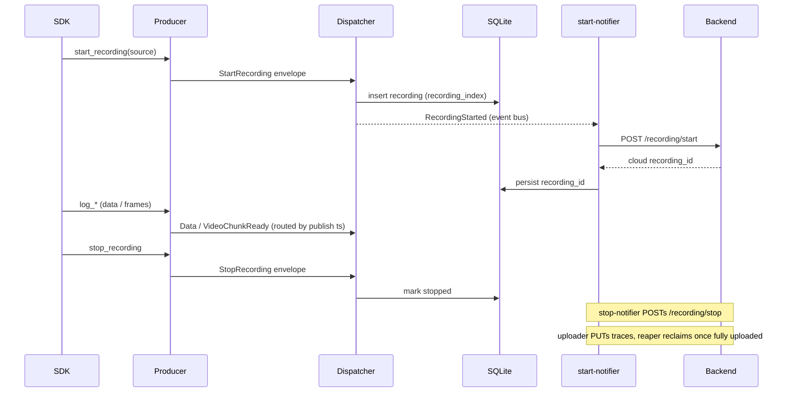

# Rust Data Daemon — Developer Guide
<!-- cspell:disable -->
This guide is for developers working on the Rust data daemon under [rust/](../rust/). For the end-user CLI (profiles, launch, stop, troubleshooting) see [data_daemon.md](data_daemon.md).

---

## Workspace layout

The [rust/](../rust/) directory is a Cargo workspace with three members declared in [rust/Cargo.toml](../rust/Cargo.toml):

| Crate | Path | What it is |
|---|---|---|
| `data-daemon` | [rust/data_daemon/](../rust/data_daemon/) | The daemon binary — CLI, lifecycle, SQLite state, IPC listener, per-trace pipeline, encoding. |
| `data_daemon_ipc` | [rust/data_daemon_ipc/](../rust/data_daemon_ipc/) | Shared library — IPC envelope types, service-name constants, payload structs. Linked by both the daemon and the producer crate. |
| `data_daemon_producer` | [rust/data_daemon_producer/](../rust/data_daemon_producer/) | PyO3 `cdylib` — producer-side IPC client exposed to Python as `neuracore.data_daemon._native_producer`. |

Shared workspace dependencies and the Rust edition (`2021`) are pinned in [rust/Cargo.toml](../rust/Cargo.toml); individual crates inherit them via `.workspace = true`.

---

## Architecture

The producer is a *thin shipper*: it publishes source/sensor/timestamp-tagged
data and fire-and-forget lifecycle events, and the daemon owns all recording
identity and routing. Pixel data never travels the IPC bus — the producer spools
NUT chunks to disk and only announces them.


A recording's lifecycle — the daemon assigns the local `recording_index`
immediately and the cloud `recording_id` is backfilled asynchronously:



---

## Prerequisites

### Rust toolchain

The pre-commit hooks and CI ([.github/workflows/rust-data-daemon.yaml](../.github/workflows/rust-data-daemon.yaml)) invoke `cargo` from your `PATH`. Install via [rustup](https://rustup.rs/):

```bash
curl --proto '=https' --tlsv1.2 -sSf https://sh.rustup.rs | sh
rustup component add rustfmt clippy
```

CI uses `stable` (via `dtolnay/rust-toolchain@stable`), so any recent stable toolchain works locally.

### System dependencies

- **ffmpeg + ffprobe** — required by the video-encoder subprocess and the `encoding::video_encoder` / `encoding::nut_writer` test suites (tests that need ffmpeg self-skip if it's missing, but the daemon itself depends on it at runtime):

    ```bash
    sudo apt-get update && sudo apt-get install -y ffmpeg
    ```

- **maturin** (only when working on the `data_daemon_producer` PyO3 crate):

    ```bash
    pip install maturin
    ```

---

## Common commands

Run all `cargo` commands from the workspace root [rust/](../rust/) unless noted otherwise. Targeting a specific crate uses `-p <crate-name>` (the workspace member names from the table above).

### Build

```bash
# Whole workspace (debug)
cargo build --workspace

# Release binary, daemon only
cargo build --release -p data-daemon

# Producer cdylib only
cargo build -p data_daemon_producer
```

The release binary lands at [rust/target/release/data-daemon](../rust/target/release/data-daemon).

### Test

```bash
# Whole workspace
cargo test --workspace

# A specific crate
cargo test -p data-daemon
cargo test -p data_daemon_ipc

# A specific module or test name (partial match)
cargo test -p data-daemon pipeline::dispatcher
cargo test -p data-daemon encoding::metadata::fixture_matches_python_video_trace_output
```

Tests that shell out to `ffmpeg` / `ffprobe` self-skip on hosts without those binaries — install them (see above) to exercise the full encoding suite.

### Format and lint

These are the gates the pre-commit hooks and CI enforce; run them before pushing.

```bash
cargo fmt --check                         # passive — fails if anything is unformatted
cargo fmt                                 # apply formatting
cargo clippy --all-targets -- -D warnings # workspace-wide, warnings denied
```

The pre-commit hooks in [.pre-commit-config.yaml](../.pre-commit-config.yaml) run `cargo fmt` and `cargo clippy` against [rust/data_daemon/](../rust/data_daemon/) only — `language: system`, so they need the local toolchain. If you don't touch any file under `rust/data_daemon/`, the cargo hooks are skipped.

### Documentation

```bash
RUSTDOCFLAGS="-D warnings" cargo doc --no-deps --document-private-items
```

The `-D warnings` flag matches CI; broken intra-doc links and missing items fail the build. Generated HTML lands at [rust/target/doc/](../rust/target/doc/).

---

## Running the daemon locally

Once built, run the CLI directly through cargo. The command tree mirrors the user-facing CLI documented in [data_daemon.md#cli-reference](data_daemon.md#cli-reference):

```bash
cargo run -p data-daemon -- profile list
cargo run -p data-daemon -- profile create dev
cargo run -p data-daemon -- launch --profile dev
cargo run -p data-daemon -- status
cargo run -p data-daemon -- stop
```

### Pointing the daemon at scratch paths

To avoid polluting your real `~/.neuracore`, override the runtime paths (also documented in [data_daemon.md#runtime-path-environment-variables](data_daemon.md#runtime-path-environment-variables)):

```bash
export NEURACORE_DAEMON_PID_PATH=/tmp/ndd-dev/daemon.pid
export NEURACORE_DAEMON_DB_PATH=/tmp/ndd-dev/state.db
export NEURACORE_DAEMON_RECORDINGS_ROOT=/tmp/ndd-dev/recordings
cargo run -p data-daemon -- launch
```

### Foreground vs background

- **Foreground** (default): logs stream to stderr, Ctrl-C triggers graceful shutdown. Use this for almost everything during development.
- **Background** (`launch --background`): double-forks via [lifecycle::daemonize](../rust/data_daemon/src/lifecycle/daemonize.rs); logs go to a `daemon.log` sibling of the SQLite DB. Use this when you specifically need to test the daemonized path or PID-file handling.

### Debug logging

`--debug` (or `NDD_DEBUG=1`) bumps the default tracing level from `info` to `debug`. `RUST_LOG` overrides both — for example:

```bash
RUST_LOG=data_daemon=trace,iceoryx2=warn cargo run -p data-daemon -- launch
```

---

## Working on the PyO3 producer

The `data_daemon_producer` crate compiles to a `cdylib` that Python imports as `neuracore.data_daemon._native_producer`. During development, use `maturin develop` from the producer crate directory to build and install it into your active virtualenv in one step:

```bash
cd rust/data_daemon_producer
maturin develop
python -c "import neuracore.data_daemon._native_producer as p; print(p)"
```

To route the Python SDK through the native producer instead of the legacy zmq one, set the rollout flag:

```bash
export NCD_RUST_DAEMON=1
python your_script.py
```

Selection logic lives in [neuracore/data_daemon/rust_selection.py](../neuracore/data_daemon/rust_selection.py); both the daemon binary handoff and the SDK's `DataStream` construction read it. A small shim bridges the native producer to the Python `ProducerChannel` contract.

---

## Packaging the wheel

The Python wheel ships two Rust artefacts inside the `neuracore.data_daemon` package:

| Artefact | Wheel location | Source crate | Imported / executed as |
|---|---|---|---|
| Daemon binary | `neuracore/data_daemon/bin/data-daemon` | `data-daemon` (bin) | Re-exec'd by [neuracore/data_daemon/__main__.py](../neuracore/data_daemon/__main__.py) when `NCD_RUST_DAEMON` is truthy |
| Producer cdylib | `neuracore/data_daemon/_native_producer*.so` | `data_daemon_producer` (cdylib) | `import neuracore.data_daemon._native_producer` from the SDK producer shim |

Both paths are inside the Python package tree, so vanilla setuptools `package_data` is enough to package them once they're built — there is no `pyproject.toml`/maturin build-backend migration. The trade-off is that each wheel build runs cargo twice (once per crate) before `python -m build` packages the result.

### One-shot local build

Use the helper script to compile both crates in release mode and copy the artefacts into the package tree at the locations the runtime expects:

```bash
./rust/scripts/build_wheel_artefacts.sh
```

What it does:

1. `cargo build --release -p data-daemon` and copies the binary to [neuracore/data_daemon/bin/data-daemon](../neuracore/data_daemon/bin/data-daemon).
2. `cargo build --release -p data_daemon_producer` and copies the cdylib to [neuracore/data_daemon/_native_producer.so](../neuracore/data_daemon/_native_producer.so) (renames `libdata_daemon_producer.so` → `_native_producer.so` so PyO3's `PyInit__native_producer` is discoverable).

Both targets are gitignored (`neuracore/data_daemon/bin/` and `*.so`); the script is idempotent so re-running it after a `cargo` edit refreshes the in-tree copies. `pip install -e .` after the script picks the new artefacts up automatically via `package_data`.

For day-to-day iteration on the producer crate only, prefer `maturin develop` from [rust/data_daemon_producer/](../rust/data_daemon_producer/) — it skips the binary build, only refreshes the cdylib, and is faster.

### Building a wheel

```bash
./rust/scripts/build_wheel_artefacts.sh
python -m build --wheel
```

The wheel is platform-tagged (Linux x86_64 today) because [setup.py](../setup.py) sets `Distribution.has_ext_modules` so setuptools tags the wheel for the host platform — without that hook setuptools would tag it `py3-none-any` and pip would happily install a Linux .so onto macOS. `package_data` ships both artefacts; `MANIFEST.in` ships the script and the `rust/` sources for the sdist.

### CI

The wheel job runs in [.github/workflows/build-wheels.yaml](../.github/workflows/build-wheels.yaml):

1. Installs the Rust toolchain + ffmpeg (for unit tests).
2. Runs the helper script above.
3. Runs `python -m build --wheel` to produce the wheel.
4. Uploads the wheel as an artefact for the release job to consume.

The matrix is Linux x86_64 only for v1; aarch64 ships when there's demand (the script is platform-agnostic — only the cross-compilation toolchain would need to grow). Each wheel is one Python version × one platform, matching the cdylib's ABI.

### Release path

The [release workflow](../.github/workflows/release.yaml) wires the wheel job into its publish step: it depends on `build-wheels.yaml`, downloads the matrix of wheels, and `twine upload`s them alongside the sdist. The sdist remains useful as a portable fallback (users build the Rust artefacts themselves at install time) but is not the recommended install path — the bundled-binary wheel is.

---

## SQLite state inspection

The daemon stores its state at `NEURACORE_DAEMON_DB_PATH` (default `~/.neuracore/data_daemon/state.db`), opened in WAL mode. Migrations live in [rust/data_daemon/migrations/](../rust/data_daemon/migrations/) and run automatically on startup via `sqlx::migrate!`. To poke at the live DB:

```bash
sqlite3 "$NEURACORE_DAEMON_DB_PATH" ".tables"
sqlite3 "$NEURACORE_DAEMON_DB_PATH" "SELECT trace_id, write_status, registration_status, upload_status FROM traces;"
```

The schema is defined by the `sqlx` migrations under [rust/data_daemon/migrations/](../rust/data_daemon/migrations/).

---

## Before committing

The pre-commit hooks cover formatting and lint, but CI also runs the test suite and builds the release binary and the docs. To catch failures locally before pushing:

```bash
cargo fmt --check
cargo clippy --all-targets -- -D warnings
cargo test --workspace
cargo build --release -p data-daemon
RUSTDOCFLAGS="-D warnings" cargo doc --no-deps --document-private-items
```

Run `pre-commit run --all-files` from the repo root to exercise the full hook chain (including the Python checks).

---

## Further reading

- [data_daemon.md](data_daemon.md) — end-user CLI, profiles, environment variables, troubleshooting.
- [contribution_guide.md](contribution_guide.md) — repo-wide contribution flow, release process, PR conventions.
