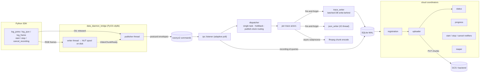
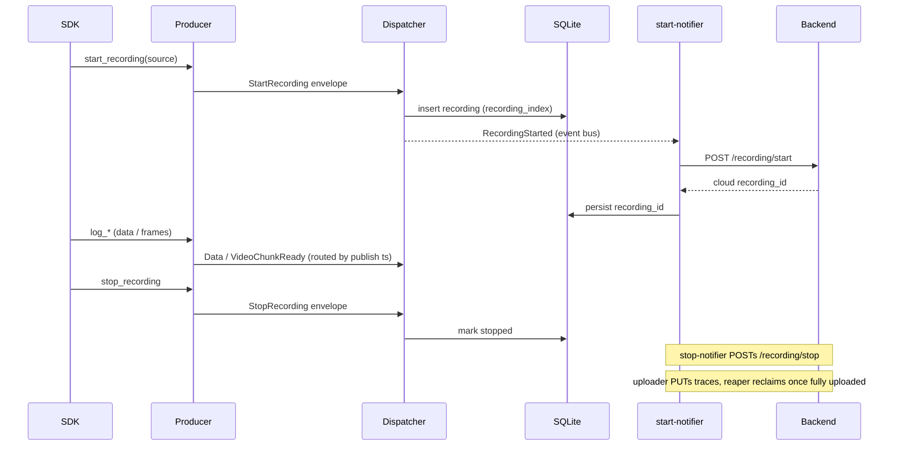

# Rust Data Daemon — Developer Guide
<!-- cspell:disable -->
This guide is for developers working on the Rust data daemon under [rust/](../rust/). For the end-user CLI (profiles, launch, stop, troubleshooting) see [data_daemon.md](data_daemon.md).

---

## Workspace layout

The [rust/](../rust/) directory is a Cargo workspace with three members declared in [rust/Cargo.toml](../rust/Cargo.toml):

| Crate | Path | What it is |
|---|---|---|
| `data-daemon` | [rust/data_daemon/](../rust/data_daemon/) | The daemon binary — CLI, lifecycle, SQLite state, IPC listener, per-trace pipeline, encoding. |
| `data_daemon_shared` | [rust/data_daemon_shared/](../rust/data_daemon_shared/) | Shared library — IPC envelope types and service-name constants, plus the daemon configuration model and filesystem-path resolution the two processes must compute identically. Linked by both the daemon and the producer crate. |
| `data_daemon_bridge` | [rust/data_daemon_bridge/](../rust/data_daemon_bridge/) | PyO3 `cdylib` — producer-side IPC client exposed to Python as `neuracore.data_daemon._data_bridge`. |

Shared workspace dependencies and the Rust edition (`2021`) are pinned in [rust/Cargo.toml](../rust/Cargo.toml); individual crates inherit them via `.workspace = true`.

---

## Architecture

The producer is a *thin shipper*: it publishes source/sensor/timestamp-tagged
data and fire-and-forget lifecycle events, and the daemon owns all recording
identity and routing. Pixel data never travels the IPC bus — the producer spools
NUT chunks to disk and only announces them.



A recording's lifecycle — the daemon assigns the local `recording_index`
immediately and the cloud `recording_id` is backfilled asynchronously:



---

## Prerequisites

### Rust toolchain

The pre-commit hooks and CI ([.github/workflows/rust-data-daemon.yaml](../.github/workflows/rust-data-daemon.yaml)) invoke `cargo` from your `PATH`. Install via [rustup](https://rustup.rs/):

```bash
curl --proto '=https' --tlsv1.2 -sSf https://sh.rustup.rs | sh
rustup component add rustfmt clippy
```

CI uses `stable` (via `dtolnay/rust-toolchain@stable`), so any recent stable toolchain works locally.

### System dependencies

- **ffmpeg + ffprobe** — required by the video-encoder subprocess and the daemon's `encoding::video_encoder` and the producer's `data_daemon_producer::nut_writer` test suites (tests that need ffmpeg self-skip if it's missing, but the daemon itself depends on it at runtime):

    ```bash
    sudo apt-get update && sudo apt-get install -y ffmpeg
    ```

- **maturin** (only when working on the `data_daemon_bridge` PyO3 crate):

    ```bash
    pip install maturin
    ```

---

## Common commands

Run all `cargo` commands from the workspace root [rust/](../rust/) unless noted otherwise. Targeting a specific crate uses `-p <crate-name>` (the workspace member names from the table above).

### Build

```bash
# Whole workspace (debug)
cargo build --workspace

# Release binary, daemon only
cargo build --release -p data-daemon

# Producer cdylib only
cargo build -p data_daemon_bridge
```

The release binary lands at [rust/target/release/data-daemon](../rust/target/release/data-daemon).

### Test

```bash
# Whole workspace
cargo test --workspace

# A specific crate
cargo test -p data-daemon
cargo test -p data_daemon_shared

# A specific module or test name (partial match)
cargo test -p data-daemon pipeline::dispatcher
cargo test -p data-daemon encoding::metadata::fixture_matches_expected_video_trace_output
```

Tests that shell out to `ffmpeg` / `ffprobe` self-skip on hosts without those binaries — install them (see above) to exercise the full encoding suite.

### Format and lint

These are the gates the pre-commit hooks and CI enforce; run them before pushing.

```bash
cargo fmt --check                         # passive — fails if anything is unformatted
cargo fmt                                 # apply formatting
cargo clippy --all-targets -- -D warnings # workspace-wide, warnings denied
```

The pre-commit hooks in [.pre-commit-config.yaml](../.pre-commit-config.yaml) run `cargo fmt` and `cargo clippy` against [rust/data_daemon/](../rust/data_daemon/) only — `language: system`, so they need the local toolchain. If you don't touch any file under `rust/data_daemon/`, the cargo hooks are skipped.

### Documentation

```bash
RUSTDOCFLAGS="-D warnings" cargo doc --no-deps --document-private-items
```

The `-D warnings` flag matches CI; broken intra-doc links and missing items fail the build. Generated HTML lands at [rust/target/doc/](../rust/target/doc/).

---

## Running the daemon locally

Once built, run the CLI directly through cargo. The command tree mirrors the user-facing CLI documented in [data_daemon.md#cli-reference](data_daemon.md#cli-reference):

```bash
cargo run -p data-daemon -- profile list
cargo run -p data-daemon -- profile create dev
cargo run -p data-daemon -- launch --profile dev
cargo run -p data-daemon -- status
cargo run -p data-daemon -- stop
```

### Pointing the daemon at scratch paths

To avoid polluting your real `~/.neuracore`, override the runtime paths (also documented in [data_daemon.md#runtime-path-environment-variables](data_daemon.md#runtime-path-environment-variables)):

```bash
export NEURACORE_DAEMON_PID_PATH=/tmp/ndd-dev/daemon.pid
export NEURACORE_DAEMON_DB_PATH=/tmp/ndd-dev/state.db
export NEURACORE_DAEMON_RECORDINGS_ROOT=/tmp/ndd-dev/recordings
cargo run -p data-daemon -- launch
```

### Foreground vs background

- **Foreground** (default): logs stream to stderr, Ctrl-C triggers graceful shutdown. Use this for almost everything during development.
- **Background** (`launch --background`): double-forks via [lifecycle::daemonize](../rust/data_daemon/src/lifecycle/daemonize.rs); logs go to a `daemon.log` sibling of the SQLite DB. Use this when you specifically need to test the daemonized path or PID-file handling.

### Debug logging

The daemon defaults to the `warn` tracing level. `--debug` (or `NDD_DEBUG=1`) bumps it to `debug`. `RUST_LOG` overrides both — for example:

```bash
RUST_LOG=data_daemon=trace,iceoryx2=warn cargo run -p data-daemon -- launch
```

---

## Working on the PyO3 producer

The `data_daemon_bridge` crate compiles to a `cdylib` that Python imports as `neuracore.data_daemon._data_bridge` (shipped inside the `neuracore` wheel). During development, use `maturin develop` from the repo root — the root `pyproject.toml` carries the `module-name` and `manifest-path` that point maturin at the crate:

```bash
maturin develop
python -c "import neuracore.data_daemon._data_bridge as p; print(p)"
```

To route the Python SDK through the data bridge instead of the legacy zmq one, set the rollout flag:

```bash
export NCD_RUST_DAEMON=1
python your_script.py
```

Selection logic lives in [neuracore/data_daemon/rust_selection.py](../neuracore/data_daemon/rust_selection.py); both the daemon binary handoff and the SDK's `DataStream` construction read it. A small shim bridges the data bridge to the Python `ProducerChannel` contract.

---

## Packaging: one merged distribution

The Rust daemon ships **inside the `neuracore` wheel**, built by maturin from
the root [pyproject.toml](../pyproject.toml). Wheels are published for Linux
x86_64 (`manylinux_2_28`) and Apple-Silicon macOS only, one per Python minor
(cp310–cp314) — **no sdist and no pure wheel**, so `pip install neuracore` on
Windows, Intel Macs, or other platforms resolves to the last pure-Python
release (13.3.0).

The two Rust artefacts and how `neuracore` finds them:

| Artefact | Location (inside the wheel) | Source crate | Reached via |
|---|---|---|---|
| Daemon binary | `neuracore/data_daemon/bin/data-daemon` | `data-daemon` (bin) | `rust_selection.rust_daemon_binary_path()` → `files("neuracore.data_daemon")/"bin"/"data-daemon"` |
| Producer extension | `neuracore/data_daemon/_data_bridge*.so` | `data_daemon_bridge` (cdylib) | `recording_context._load_native()` → `import neuracore.data_daemon._data_bridge` |

Both lookups degrade gracefully when the artefacts are absent — e.g. a source
build without the daemon binary (binary path → `None`, extension import → a
helpful `RuntimeError`).

The extension is built by maturin itself (`module-name`/`manifest-path` in
`[tool.maturin]`); the daemon binary is a *separate* crate maturin doesn't
build, so `rust/scripts/build_wheel_artefacts.sh` compiles it into
`neuracore/data_daemon/bin/` first and `[tool.maturin] include` bundles it.
Both paths are gitignored. All other package data (the yaml/txt/md config
trees) ships via maturin's auto-include of tracked files under `neuracore/`.

The old `daemon` extra is kept as an empty no-op alias so
`pip install neuracore[daemon]` keeps resolving.

### Local build

```bash
./rust/scripts/build_wheel_artefacts.sh   # cargo build -p data-daemon -> neuracore/data_daemon/bin/data-daemon
maturin develop                           # builds + editable-installs _data_bridge into the active env
```

`maturin develop` builds and installs the **extension only** — it doesn't run
the binary build or evaluate `include`, so run the helper script first for an
end-to-end daemon. `pip install -e .` (or `.[dev]`) at the repo root does the
same maturin build via PEP 517, so a Rust toolchain (plus libclang for
iceoryx2's bindgen) is required for any source install.

### Building wheels

```bash
./rust/scripts/build_wheel_artefacts.sh
maturin build --release --out dist --interpreter python3.10 python3.11 python3.12 python3.13 python3.14
```

Wheels are platform- and Python-specific: pyo3 uses `extension-module` without
`abi3` (the zero-copy `PyBuffer` frame path rules out `abi3-py310` — the buffer
protocol only enters the limited API at 3.11), so each wheel is one Python
minor × one platform and `--interpreter` must be passed.

> **Daemon: Linux and Apple-Silicon macOS only.** The daemon stack uses
> `iceoryx2` shared-memory IPC; platform-specific syscalls (e.g.
> `sync_file_range`, `gettid` on Linux) are gated behind `cfg(target_os)` so the
> stack also builds and runs on macOS. Wheels ship for `linux-x86_64` and
> `macosx-arm64` — **not** Intel Macs or Windows.

### CI

[.github/workflows/build-wheels.yaml](../.github/workflows/build-wheels.yaml) builds
the `neuracore` wheels — a `PyO3/maturin-action` matrix over `linux-x86_64` and
`macosx-arm64`, each leg building all five interpreters (cp310–cp314). The Linux
leg builds the daemon binary inside the `manylinux_2_28` container (glibc match,
plus a `clang` install for iceoryx2's bindgen — `manylinux_2_28` is required over
the default `manylinux2014` because iceoryx2's bindgen needs libclang >= 5.0,
which 2014's clang 3.4 can't provide); the macOS leg builds natively on a
`macos-15` Apple-silicon runner (libclang via `brew install llvm`, deployment
target pinned to 11.0). A separate `smoke-test` job then installs each wheel
and launches the daemon binary on a *different* machine than the builder (the
macOS leg on a different OS image, `macos-14`, with a `codesign --verify`) —
proving the wheels, including the binary's ad-hoc signature, work outside the
build environment.

### Release path

The [release workflow](../.github/workflows/release.yaml) bumps the version
(root pyproject only, via [.bumpversion.cfg](../.bumpversion.cfg)), pushes the
tag, re-runs `build-wheels.yaml` against that tag, and publishes **all** wheels
in a single job only after every platform leg succeeds — so a version can never
be half-published. `twine --skip-existing` makes re-running idempotent.

---

## SQLite state inspection

The daemon stores its state at `NEURACORE_DAEMON_DB_PATH` (default `~/.neuracore/data_daemon/state.db`), opened in WAL mode. Migrations live in [rust/data_daemon/migrations/](../rust/data_daemon/migrations/) and run automatically on startup via `sqlx::migrate!`. To poke at the live DB:

```bash
sqlite3 "$NEURACORE_DAEMON_DB_PATH" ".tables"
sqlite3 "$NEURACORE_DAEMON_DB_PATH" "SELECT trace_id, write_status, registration_status, upload_status FROM traces;"
```

The schema is defined by the `sqlx` migrations under [rust/data_daemon/migrations/](../rust/data_daemon/migrations/).

---

## Before committing

The pre-commit hooks cover formatting and lint, but CI also runs the test suite and builds the release binary and the docs. To catch failures locally before pushing:

```bash
cargo fmt --check
cargo clippy --all-targets -- -D warnings
cargo test --workspace
cargo build --release -p data-daemon
RUSTDOCFLAGS="-D warnings" cargo doc --no-deps --document-private-items
```

Run `pre-commit run --all-files` from the repo root to exercise the full hook chain (including the Python checks).

---

## Further reading

- [data_daemon.md](data_daemon.md) — end-user CLI, profiles, environment variables, troubleshooting.
- [contribution_guide.md](contribution_guide.md) — repo-wide contribution flow, release process, PR conventions.
